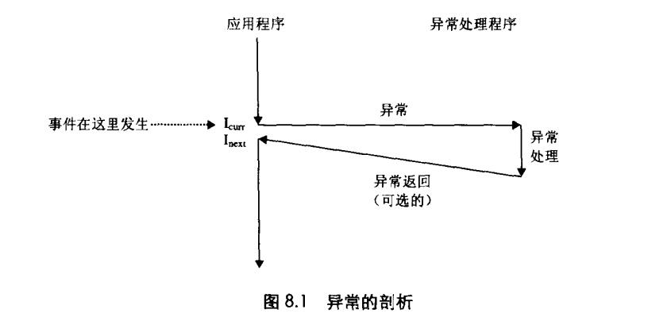
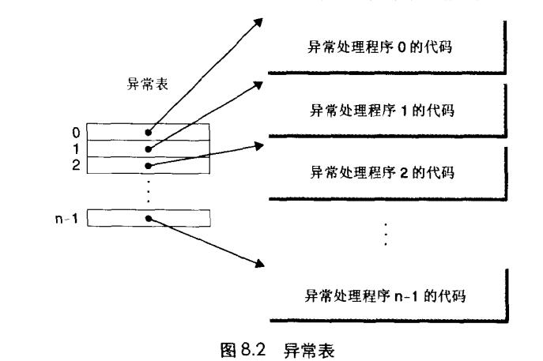
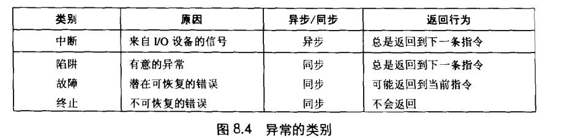
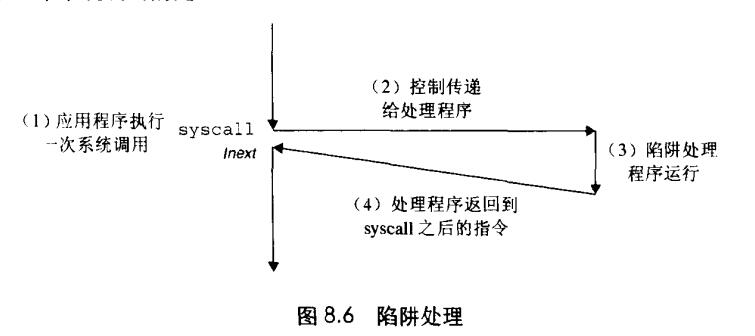
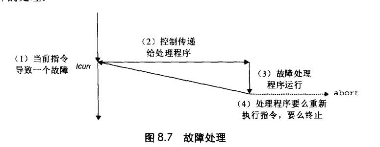

# Chapter.8 异常控制流

pre Chapter 3.7

--------------

## 介绍

从给处理器加电开始,直到断电为止,程序计数器假设一个值的序列  

a0,a1,...,aN-1  -这个控制序列被称为`控制流`

ak是某个相应的指令`Ik`的地址。每次从`ak`到`ak+1`的过渡成为`控制转移(control transfer)`。

像上面这种流是最平滑(即没有突变)的控制流序列

但是系统也必须能够对系统状态的变化做出反应。比如

- 硬件定时器定期产生信号,产生的事件需要被处理
- 数据包到达网络适配器后,必须存放在内存中
- 程序向磁盘请求数据,然后休眠,直到被通知说数据已就绪

这种突变被称为`Exceptional Control Flow, ECF` `异常控制流`

异常控制流可能发生在计算机系统的各个层次

--------------

## 8.1 异常

异常 `就是控制流中的突变`

当处理器检测到有事件发生时,它就会通过一张叫做`异常表`的跳转表,进行一个间接过程调用,到一个专门设计用来处理这类事件的操作系统子程序(`异常处理程序(exception handler)`),**当异常处理程序完成处理后,根据引起异常的事件的类型,会触发一下3种情况中的一种**

- 1. 处理程序将控制返回给`I_next`,即当事件发生时正在执行的指令
- 2. 处理程序将控制返回给`I_next`,如果没有发生异常将会执行的下一条指令
- 3. 处理程序终止被中断的程序

> throw和try以及catch这类语法提供的是应用级的ECF(异常控制流)

### 8.1.1 异常处理

在系统启动时,操作系统分配和初始化一张称为`异常表`

系统中每种可能类型的异常都分配了一个唯一的非负整数的`异常号`。其中一些号码是由处理器的设计者分配的。还有一些是操作系统的设计者分配的。

- 1. 处理器分配主要是 `被零除、缺页、内存访问违例、断点以及算术运算溢出`
- 2. 操作系统分配主要是 `系统调用,来自外部设备的I/O等`

异常表的首地址存放在一个叫`异常表基址寄存器`的特殊CPU寄存器中

当处理器检测到一个事件,并且确定了异常号后,触发异常,且`异常运行在内核态`

异常执行结束后,会执行一条`从中断返回`指令,该指令会适当的状态弹回处理器的控制和数据寄存器中。比如恢复`用户模式`,并将控制返回给被中断的程序。

### 8.1.2 异常的类别

- 中断(interrupt)  (I/O外设的异常)
- 陷阱(trap)  (有意的异常)
- 故障(fault)
- 终止(abort)

#### 中断

中断是异步发生的,是来自处理器外部的`I/O设备`的信号的结果

例如键盘控制器通过向处理器芯片上的一个引脚发信号,并将异常号放到系统总线上,来触发中断,这个异常号标识了引起中断的设备。

即CPU会监听异常号,触发中断后,就执行中断,执行完毕返回主流程继续执行。这个过程是异步的。

#### 陷阱和系统调用 

陷阱是有意的异常,其中一个最重要的用途就是用户程序和内核之间的一种接口  --  `系统调用`

比如读文件(read),创建新进程(fork),加载新程序(execve),终止当前进程(exit)

CPU提供了一条特殊的`syscall n`指令,用于处理用户态对内核态的`受控访问`

每次执行syscall都会到一个异常处理程序的`陷阱`

#### 故障

故障可能被修复,如果可以修复,则返回到触发处继续执行,否则进入abort例程(`终止`)

#### 终止

错误触发后直接结束程序

--------------

> Latex转Svg

https://www.latexlive.com/