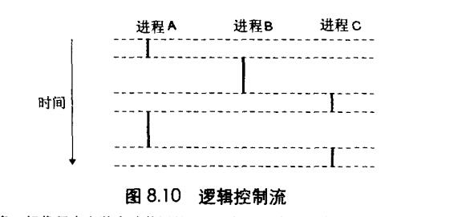
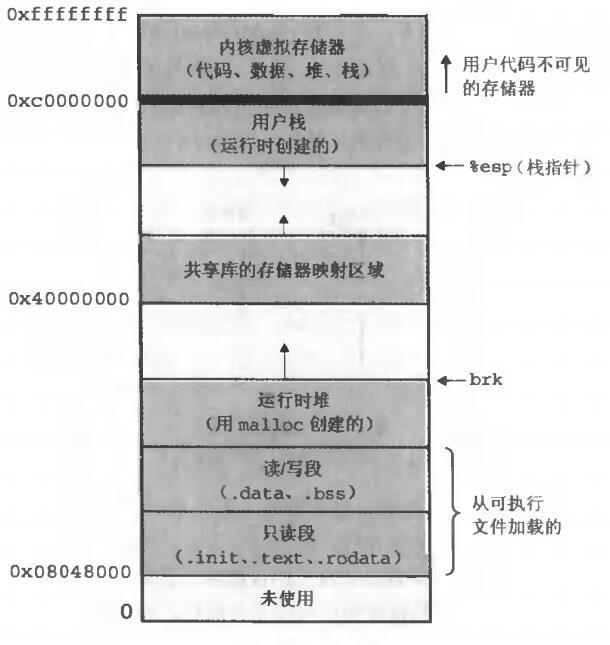
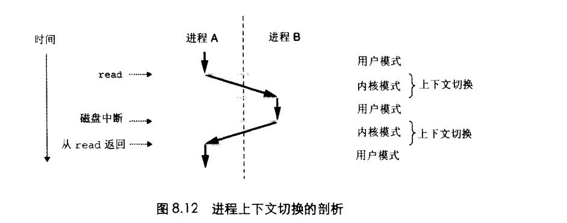

# Chapter.8 异常控制流

pre Chapter 3.7

--------------

## 介绍

从给处理器加电开始,直到断电为止,程序计数器假设一个值的序列  

a0,a1,...,aN-1  -这个控制序列被称为`控制流`

ak是某个相应的指令`Ik`的地址。每次从`ak`到`ak+1`的过渡成为`控制转移(control transfer)`。

像上面这种流是最平滑(即没有突变)的控制流序列

但是系统也必须能够对系统状态的变化做出反应。比如

- 硬件定时器定期产生信号,产生的事件需要被处理
- 数据包到达网络适配器后,必须存放在内存中
- 程序向磁盘请求数据,然后休眠,直到被通知说数据已就绪

这种突变被称为`Exceptional Control Flow, ECF` `异常控制流`

异常控制流可能发生在计算机系统的各个层次

--------------

## 8.2 进程

一场是允许操作系统内核提供进程(process)概念的基本构造块。

进程: 一个执行中程序的实例,每个程序都运行在某个进程的`上下文`中

这个上下文有程序正确运行所需要的转台组成.这个状态包括:  
- 存放在内存中的程序代码和数据
- 栈
- 通用目的寄存器的内容
- 程序计数器
- 环境变量,文件描述符

进程提供给应用程序的关键抽象  
- 1. 一个独立的逻辑控制流 仿佛程序独占了处理器
- 2. 一个私有的地址空间 仿佛程序独占了内存

### 8.2.1 逻辑控制流

一个程序的PC值是`逻辑控制流`

进程轮流使用处理器,每个进程执行流的一部分,然后被`抢占`,轮到其他进程。但每个进程的`逻辑流`一般来说都是互相独立的

> **进程间通信**(IPC) 会破坏掉互相独立的规则
>> 管道、套接口、共享存储器、信号量

如上图所示, A和BC是并发进程,B和C不是并发进程(定义,时间段上都有逻辑流)

### 8.2.3 私有地址空间

`进程为每个程序提供它自己的私有地址空间`,这段空间不能被其他进程读写

通常这个私有地址空间都是 `结构相同` 的,(即五大区)

地址空间上面`1/4是预留给内核(比如系统调用)`,下面3/4是`预留给用户`  
下面通常包括文本、数据、堆和栈

### 8.2.4 用户模式和内核模式

- 内核模式: 可以执行指令集任何指令,可以访问任何存储器位置
- 用户模式: 有限制

为了保护操作系统不被进程破坏,处理器会限制一个进程可以执行的指令和可以访问的地址空间。  
典型的,有一个`控制寄存器`,这个寄存器中有一个`方式位`,该寄存器描述了进程当前享有的权利。  
如果当前进程的方式位设置的时候,进程就在`内核模式`中。

`方式位`没设置时,进程就在`用户模式`中,用户模式不允许使用`特权指令`,也不允许用户`直接引用内核区的代码和数据`,必须通过系统调用的接口来访问内核代码和数据.

进程从用户模式转到内核模式的唯一方法:  
- 中断
- 故障
- 系统调用这样的异常

当异常出现时,控制传递到异常处理程序,处理器将进程从用户模式编程内核模式。当返回到应用代码时,处理器就把模式从内核模式变为用户模式。

### 8.2.5 上下文切换

进程的上下文通常保存一个进程所需要的所有信息,比如内存五大区,程序计数器,各种计数器...

内核决定哪些进程可以抢占当前进程,这个决定就叫做`调度`,由`调度器`的代码处理.  
当进程发生切换时,就需要进行上下文的切换,一个上下文主要有以下几点作用  
- 1. 保存当前进程的上下文
- 2. 恢复某个先前被抢占进程所保存的上下文
- 3. 将控制传递给这个新回复的进程

> 即使通过系统调用在内核态,或者中断,也可以发生上下文转换

比如如下A通过系统调用触发上下文转换,然后磁盘通过中断触发上下文切换

--------------

## 8.3 系统调用和错误处理

C语言提供了大量系统调用的接口,但是系统调用可能会出错,这时候就需要用到错误处理(不能忽略)

为了简化调用系统调用时的代码逻辑,可以将它封装成一个库

`代码见书的附录B`

--------------

> Latex转Svg

https://www.latexlive.com/