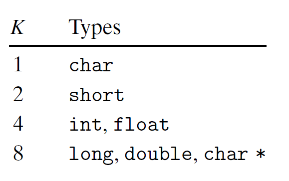

# Ch3 Machine-Level Representation of Programs

## 3.9 Heterogeneous Data Structures

**数据对齐**

数据对齐的限制简化了处理器和内存系统之间的接口的硬件设置，保证在一次内存访问中获取某个数据，否则需要两次内存访问。

Intel 建议对数据进行对齐，提升内存系统的性能。

对齐原则为：任何 $K$ 字节的基本对象的地址必须是 $K$ 的倍数。

* 必须确保每种数据类型都按照指定的方式来组织或者分配，才能保证实施对齐。

* 编译器通过在汇编代码中插入 `.align 8` 类似的指令，保证其后面的数据会遵守 8 字节对齐的限制。
* 对于结构体类型的数据对齐，编译器会在其需要分配的字段中插入缝隙，保证每个字段都满足其对齐要求，此外，结构体本身的起始地址也需要进行对齐。

