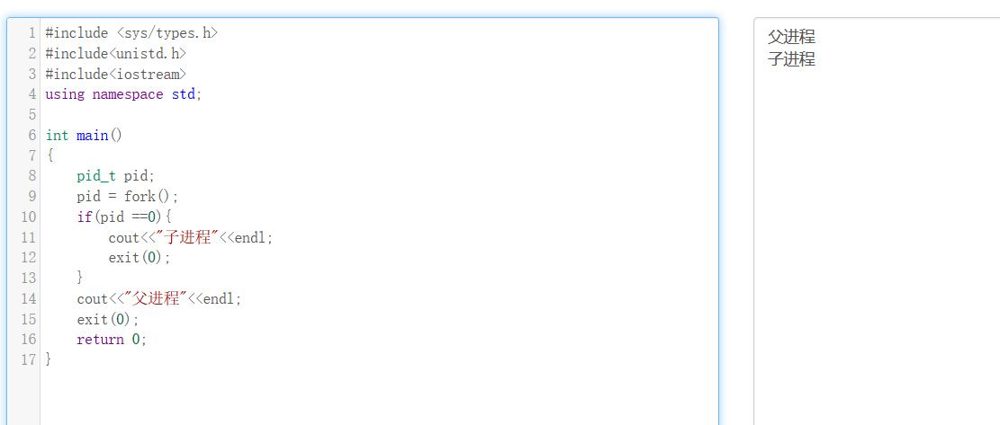
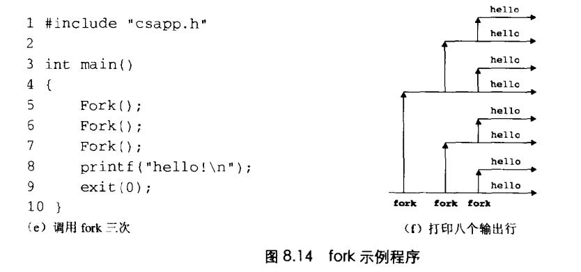

# Chapter.8 异常控制流

pre Chapter 3.7

--------------

## 介绍

从给处理器加电开始,直到断电为止,程序计数器假设一个值的序列  

a0,a1,...,aN-1  -这个控制序列被称为`控制流`

ak是某个相应的指令`Ik`的地址。每次从`ak`到`ak+1`的过渡成为`控制转移(control transfer)`。

像上面这种流是最平滑(即没有突变)的控制流序列

但是系统也必须能够对系统状态的变化做出反应。比如

- 硬件定时器定期产生信号,产生的事件需要被处理
- 数据包到达网络适配器后,必须存放在内存中
- 程序向磁盘请求数据,然后休眠,直到被通知说数据已就绪

这种突变被称为`Exceptional Control Flow, ECF` `异常控制流`

异常控制流可能发生在计算机系统的各个层次

--------------

## 8.4 进程控制

```cpp
pid_t getpid(void); //可以获得当前进程id
```

> 创建和终止进程
>> `fork`是`unix`上的系统调用,Windows上要使用thread库

http://146.56.209.11:90/2021/10/01/c-%ef%bc%88%e5%8d%81%e4%b8%80%ef%bc%89%e7%ba%bf-%e8%bf%9b%e7%a8%8b%e7%9b%b8%e5%85%b3/


进程的三个状态,运行,就绪,阻塞   *以及终止

- 运行: 要么在CPU上执行,要么在等待调度(时间片)
- 阻塞(暂停): 执行被挂起,且不会被调度,当收到`SIGSTOP、SIGTSTP、SIDTTIN、SIGTTOU`等信号时,进程就暂停,直到收到`SIGCONT`信号,才会再次运行.
- 终止: 永远停止,1. 收到信号终止. 2. 从主程序返回 3. 调用exit()函数


--------------


## 父子进程

新创建的子进程和父进程`很像`,但不完全相同,子进程得到父进程用户虚拟空间的一份拷贝.以及打开文件描述符相同的拷贝,这表明子进程可以读写父进程中打开的任何文件.  
两者最大的区别是`PID`不同

如下图所示,fork()命令会返回两次.因为子进程的pid总是0

其实本质的意思是这样的,fork函数会有两次返回,一次是继续执行父进程,一次是在子进程中继续执行  

父子进程具有相同但是完全独立的内存空间,即调用fork时保存现场,但是之后的执行都是各自的逻辑了.




如下图,多次调用fork时的情况




--------------

## 回收子进程

当一个`子进程`因为某些原因终止时,内核并不会立即把它清除,相反,它会一直保持着已终止的状态,直到它的父进程`回收`.  
一个被终止但是还未被回收的进程被称为`僵死进程`  

如果一个父进程终止了,子进程的父进程会变成`init`,`init`这个进程的PID是1,系统启动时内核创建的,不会终止.init会主动回收僵死进程.  

但是一个服务器如果长时间运行不终止,也应该去主动回收僵死进程.不然会一直占用资源

```cpp
waitpid(pid_t pid,int *statusp,int options);
```

一个进程可以调用waitpid函数来等待他的子进程终止或者终止它

--------------

> 让程序休眠
>> sleep
>> pause

>  加载并运行程序
>> execve(const char *filename,const char *argv[],const char *envp[]);
>> **execve是在当前进程上下文中创建了一个新的程序,但是不会额外的多出一个进程**


--------------


> Latex转Svg

https://www.latexlive.com/