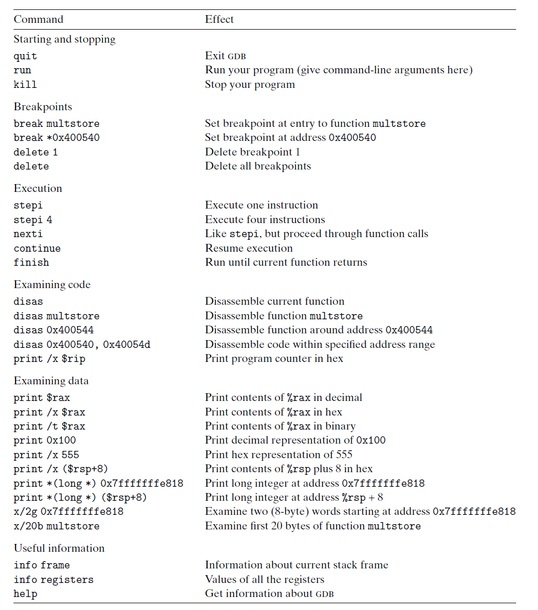

# Ch3 Machine-Level Representation of Programs

## 3.10 Combining Control and Data in Machine-Level Programs

**理解指针**

* 每个指针都对应一个类型，该类型表明该指针指向的是哪一类对象；
    * malloc 函数返回 void* 通用指针，程序员通过强制类型转将其转换为有类型的指针；
    * 指针类型不是机器码中的一部分，其为 C 语言提供一种抽象，帮助程序员避免寻址错误。
* 每个指针都有一个值，该值表示的是某个指定类型的对象的地址，NULL(0) 表示未指向任何地方；
* `&` 用于创建指针，leaq 指令用于计算内存引用的地址，`&` 通常由 leaq 来计算；
* `*` 用于间接引用指针；
* 区分指针和数组；
* 指针类型的强制转换；
    * 假设 p 是 char* 类型的指针，其值为 p；则
    * (int * )p + 7 计算为 p + 28；(int * )(p + 7) 计算为 p + 7；
* 函数指针。

**GDB**

