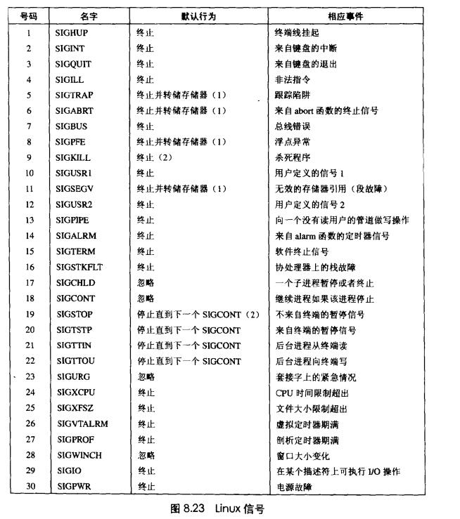
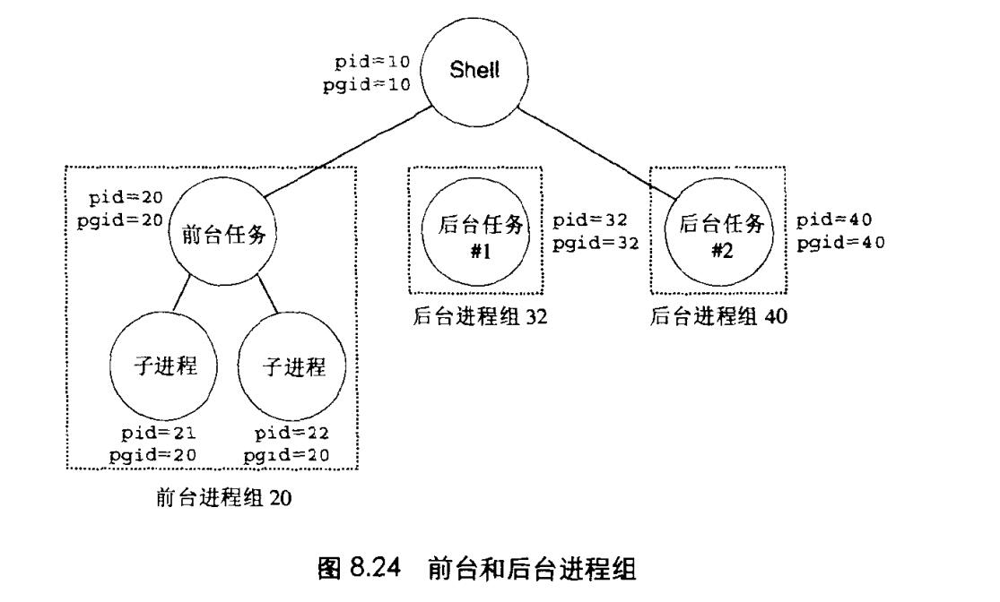

# Chapter.8 异常控制流

pre Chapter 3.7

--------------

## 介绍

从给处理器加电开始,直到断电为止,程序计数器假设一个值的序列  

a0,a1,...,aN-1  -这个控制序列被称为`控制流`

ak是某个相应的指令`Ik`的地址。每次从`ak`到`ak+1`的过渡成为`控制转移(control transfer)`。

像上面这种流是最平滑(即没有突变)的控制流序列

但是系统也必须能够对系统状态的变化做出反应。比如

- 硬件定时器定期产生信号,产生的事件需要被处理
- 数据包到达网络适配器后,必须存放在内存中
- 程序向磁盘请求数据,然后休眠,直到被通知说数据已就绪

这种突变被称为`Exceptional Control Flow, ECF` `异常控制流`

异常控制流可能发生在计算机系统的各个层次

--------------

## 8.5 信号

信号是一种软件形式的异常。称为Linux信号,它允许进程和内核中断其他进程。  

比如,如果一个进程试图除以0,内核就会发给它一个`SIGFPE`信号.如果一个进程试图执行一条非法程序,内核就会发给他一个`SIGILL`信号  




> 信号术语
>> 传送一个信号到进程由两个不同的步骤组成

- 发送信号,内核通过更新目的进程上下文中的某个状态,发送一个信号给目的进程.
    - 1. 进程内部出错,内核侦测到了
    - 2. 进程发送`kill`,通知其他进程
    - 3. 进程自己也可以给自己发信号
- 接收信号,目的进程会被内核强迫执行对应信号. `如果发送了但是没有接受到的信号叫做待处理信号`

### 8.5.2 发送信号

1. 进程组  
**每个进程都只属于一个进程组**,进程组是由一个正整数进程组ID来标识的.`getpgrp`函数返回当前进程的进程组`Id`  

**子进程和父进程同属一个进程组**

`setpgid`函数设置进程组id

> `/bin/kill`程序可以发送任意信号给其他进程

比如

```cpp
linux> /bin/kill -9 -15213
```

查上面的信号表,可以看到9对应的是`SIGKILL`,即发送`SIGKILL`给进程15213

在代码中也可以调用kill来实现类似操作

> 多作业(**作业**-job)
>> 使用`|`进行连接
>> 多作业是在同一个前台作业中运行的

比如

```cpp
linux> ls | sort
```

如图所示:  




### 8.5.3 接收信号

当内核把进程`p`从内核模式切换到用户模式的时候,它会检查进程p的未被阻塞的**待处理信号的集合**,如果为空,执行`I_next`,否则进行信号处理,处理结束之后如果可以回到进程,就执行`I_next`(下一条指令)

每个信号都有一个自定义的默认行为,比如  

- 进程终止
- 进程终止并转储内存
- 进程停止(挂起)直到被SIGCOUNT信号重启
- 进程忽略该信号

除了SIGSTOP和SIGKILL,其他信号是可以被修改默认行为的**(代码见CSAPP P531)**


--------------


> Latex转Svg

https://www.latexlive.com/