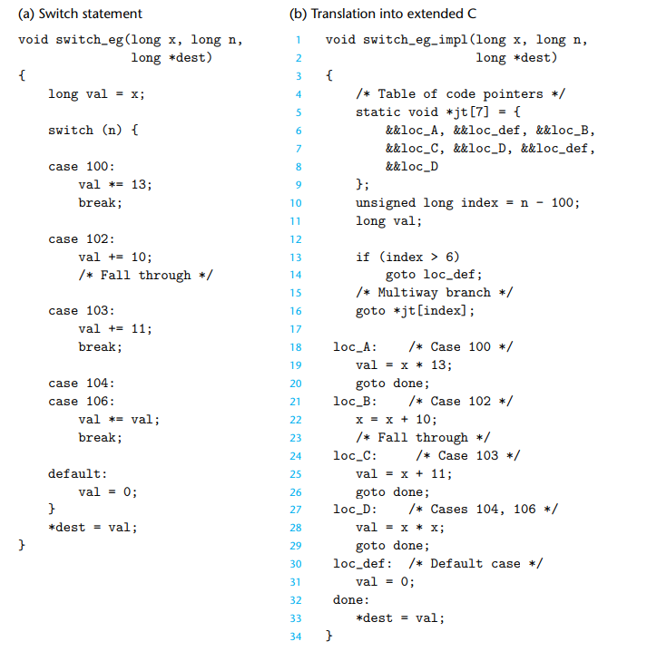

## 习题3.27

将fibonacci函数重写成guarded-do形式:
```c
long fact_guarded_do(long n) {
    long i = 2;
    long result = 1;
    if (i > n) {
        goto end;
    }
loop:
    result *= i;     
    i++;
    if (i <= n) {
        goto loop;
    }
    end:
    return result;
}
```

## 习题3.29

A 我们需要注意的是 最后的update-expression不能被continue

B  

```c
if (i & 1) {
    goto skip-boody;
}
body-statement;
skip-body:
    ;
```

## 3.6.8 Switch Statement

switch statement 不仅仅让代码变得更加可读,并且他们通过jump table使得实现的更加有效率。

这样的话switch语句的数量就和执行的时间没有什么关系了，GCC根据case的多少，以及稀疏的程度来是否选用jump table。

一个例子如下:



jt 是一个jump_table，里面存储着根据偏移量(-100后)的跳转地址，对于那些没有被定义的如101, 105, 可以看到在对应的jt的第1，5项中
存放的是&&loc_def，也就是跳转到default语句上。

在实际的汇编代码中，jt是存储在`.rodata` 并以8字节对齐。