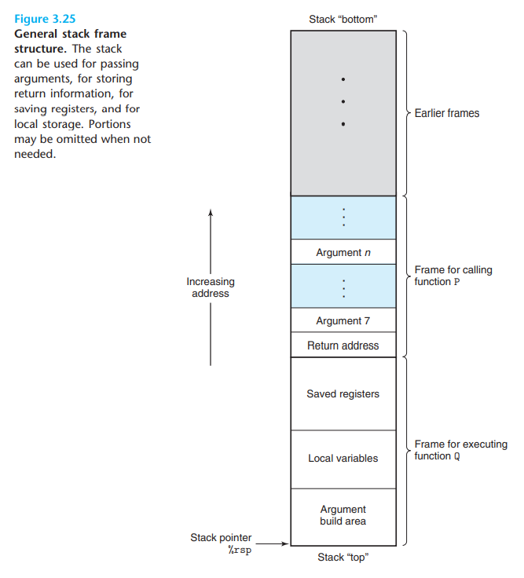

## 3.7.1 Run-Time Stack

x86-64架构中，栈顶是%rsp,并且向下增长，数据可以通过pushq和popq来从memory中存储/获取。分配空间是十分简单的，只需要将sp减若干个值就可以。当然初始值是不确定的。

当请求的空间大于寄存器所能存放的大小时，会在栈上分配数据，这个区域叫做栈帧，下图是一个通用的栈帧格式

对于当前正在运行的函数而言，总是在使用这个栈的栈顶部分，也就是低的虚拟地址，stack frame一半而言是fixed-size的。

出于时间和空间效率的考量，x86-64仅仅在需要的时候分配栈帧，也就是地方不够的时候，比如，很多函数其实并没有很多的参数传递，那么这些参数完全可以更快的寄存器存储。

## 3.7.2 Control Transfer

将控制权从P转移到Q包含简单设置PC的值为Q的初始地址。返回的时候需要回到正确的地址，所以调用函数的时候，将所有参数压入栈后，需要再压入一个下一个指令的pc值，那么ret指令就是弹出栈顶元素并把这个值设置为PC。
