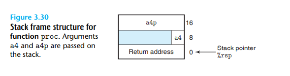

## 3.7.3 Data Transfer

对于x86-64架构最多有6个argument，integer或者pointer可以被寄存器传递。他们遵循一种特殊的原则，前两个是`%rdi`,`%rsi`

如果超出了，那么需要分配stack的空间。

```c
void proc(long a1, long *a1p,
int a2, int *a2p,
short a3, short *a3p,
char a4, char *a4p) {
    *a1p += a1;
    *a2p += a2;
    *a3p += a3;
    *a4p += a4;
}
```

这个例子中，有8个参数，那么前6个存储在寄存器中，后两个a4, a4p存储在stack上。

```
1 proc:
2 movq 16(%rsp), %rax Fetch a4p (64 bits)
3 addq %rdi, (%rsi) *a1p += a1 (64 bits)
4 addl %edx, (%rcx) *a2p += a2 (32 bits)
5 addw %r8w, (%r9) *a3p += a3 (16 bits)
6 movl 8(%rsp), %edx Fetch a4 ( 8 bits)
7 addb %dl, (%rax) *a4p += a4 ( 8 bits)
8 ret Return
```



需要注意的是，即使a4只是一个1字节的char变量，但我们也需要使用8字节存储。


