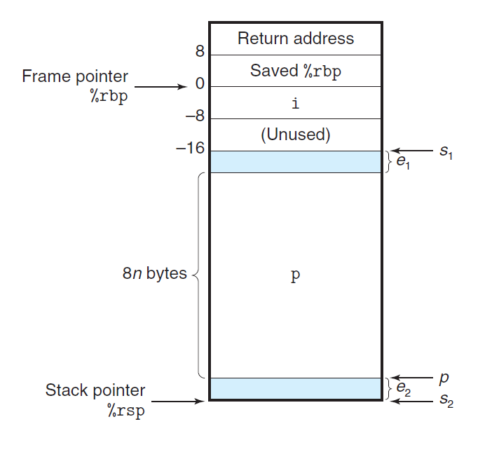

# Ch3 Machine-Level Representation of Programs

## 3.10 Combining Control and Data in Machine-Level Programs

**支持变长栈帧**

* 某些函数，需要的局部存储是变长的；例如，alloca 标准库函数，可以在栈上分配任意字节数量的存储。

* 为了管理变长栈帧，x86-64 使用寄存器 `%rbp` 作为栈指针（frame pointer，或 base pointer）；当使用栈指针时，栈帧的情况如下图：

    

* 把之前的 `%rbp` 值保存在栈中（callee saver），然后在函数的执行过程中，使得 `%rbp` 指向当前栈的位置；

* 在被调用者的新栈帧中，首先存储的是固定大小的局部存储，然后再分配变长大小的局部存储；

* 在函数调用的结尾的 leave 指令相当于：

    ```assembly
    movq %rbp, %rsp
    popq %rbp
    ```

    即首先把栈指针设置为 `%rbp` 保存值的位置，然后把该值弹出到 `%rbp` 中，这样就释放了整个栈帧。

