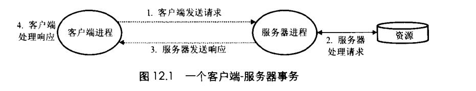
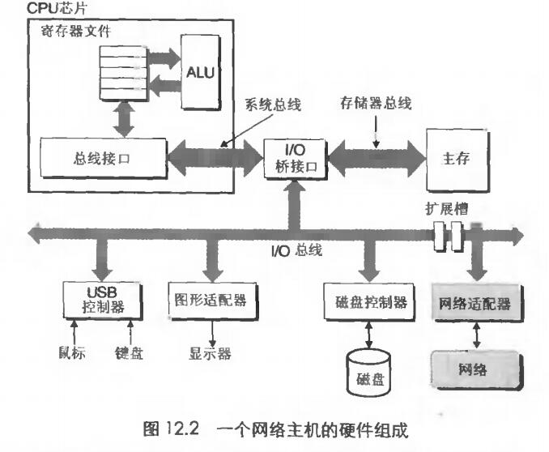
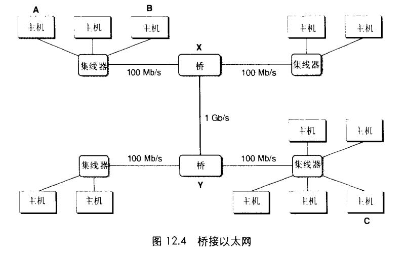
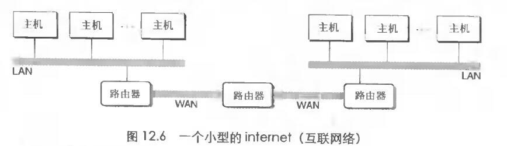
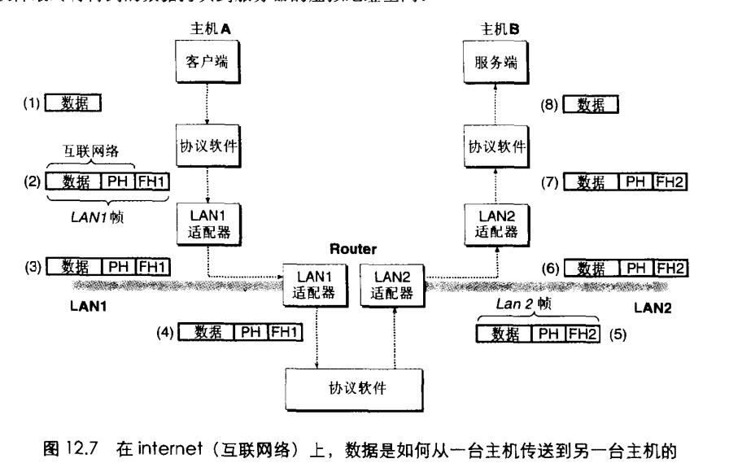

# Chapter.11 网络编程

pre Chapter 3.7

--------------

## 11.1 客户端-服务器编程模型

网络应用大部分是基于`客户端-服务器`模型的,一个应用是由一个`服务器进程`和`多个客户端进程`组成(当然,这点现在已经改变很多了)

服务端掌握资源,代表客户端进行存储和检索,客户端-服务器模型中基本操作是`事务`,一个客户端-服务器事务主要由一下四步组成:  
- 客户端需要服务时,向服务器发送请求,发起一个事务。(例如: Web浏览器需要一个文件,发起一个请求给Web服务器)
- 服务器收到请求后,解释它,然后操作服务端资源
- 服务端给客户端一个响应,等待下一个请求
- 客户端收到响应并处理它

即: 客户端与服务端均是 `进程`

--------------

## 11.2 网络

### 局域网

**对于主机而言,网络只是一种I/O设备,是数据源和数据接收方**

一个插到了I/O总线扩展槽的适配器提供了到网络的物理接口.从网络上接收到的数据从适配器经过I/O和内存总线复制到内存.反之亦可.

按照地理远近分的最底层是LAN(局域网),最常使用的技术是`以太网`

以太网技术:  

通常一个以太网段有一个集线器,每个主机有网络适配器,如上图,一个以太网段内所有主机的适配器都连接到集线器的一个端口上.  

网段内每一个主机都可以发送一段位`称为帧`到这个网段内任何主机,每个帧包括一定固定数量的`头部位`,用来标识此帧的源和目的地址以及此帧的长度,此后紧随的就是数据位的`有效载荷`.

集线器会把这段帧发送给网段内每个主机,每个主机都能看到这个帧,但是`只有目的主机才能实际读取它`

### 网桥

使用网桥,可以把多个局域网组合成一个大的局域网,称为`桥接以太网`.如上图

网桥通过一种算法会随着时间(比如多次的数据进出)自动学习`哪个主机可以通过哪个端口可达`,然后只在有必要时,才会将帧从一个端口复制到另一个端口.

比如上图中A向B发送消息,数据到达桥X时就会把数据丢弃掉,不去转发,其他网段的带宽就被节省掉了

### 路由器

在更高级别中,多个不兼容的局域网可以通过叫`路由器`的特殊计算机连接起来,组成一个`internet(互联网络)`,被称为`WAN(广域网)`

### 互联网

互联网的一个特性是,它能有采用完全不同和不兼容技术的各种局域网和广域网组成。

互联网解决不兼容的方法是通过`主机`和`路由器`上运行的`协议软件`.这个协议控制主机和路由器如何协同工作来实现数据传输。  
协议必须提供两项基本能力:  
- 命名机制: 每台主机必须有一个`互联网络地址,唯一标识这台主机`
- 传送机制: 互联网协议通过把数据位绑成不连续的片(称为包),来消除差异.一个包是由包头和有效载荷组成(包头包括包的大小,和源目标地址以及目的主机的地址,有效载荷包括数据位)

上图是两个主机如何在互联网中交互,主要有8个步骤

- A上的客户端进行一个系统调用,从客户端的虚拟地址空间复制数据到内核缓冲区中,
- 主机A上的协议软件通过在数据前附加互联网包头和LAN1帧头,创建了一个LAN1的帧,互联网包头寻址到B,LAN1寻址到路由器。然后LAN1把此帧传送给路由器,`帧的有效载荷是路由器的包`,`路由器包的有效载荷是数据`,
- LAN1适配器复制该帧到网络上
- 此帧到达路由器的`LAN1适配上`时,LAN1适配器从电缆上读取它,并把它传送到协议软件,
- 路由器从包头读取到目的互联网络地址,并用它作为路由表的索引,重定向哪里转发这个包,之后`剥离LAN1帧头`,然后`添加LAN2帧头`,制作好帧以后,复制到查表得到的适配器上.
- 路由器的LAN2适配器复制该帧到网络上
- 此帧到达主机B时,它的适配器从电缆上读取此帧,并把它传送到协议软件
- 最后,主机B根据协议软件剥离包头和帧头,当服务器进行一个读取这些数据的系统调用时,协议软件最终将得到的数据复制到服务器的虚拟地址空间内

`上面只是一个简化的互联网传输的思想,即封装再封装,具体的实现需要系统学习`

--------------

> Latex转Svg

https://www.latexlive.com/