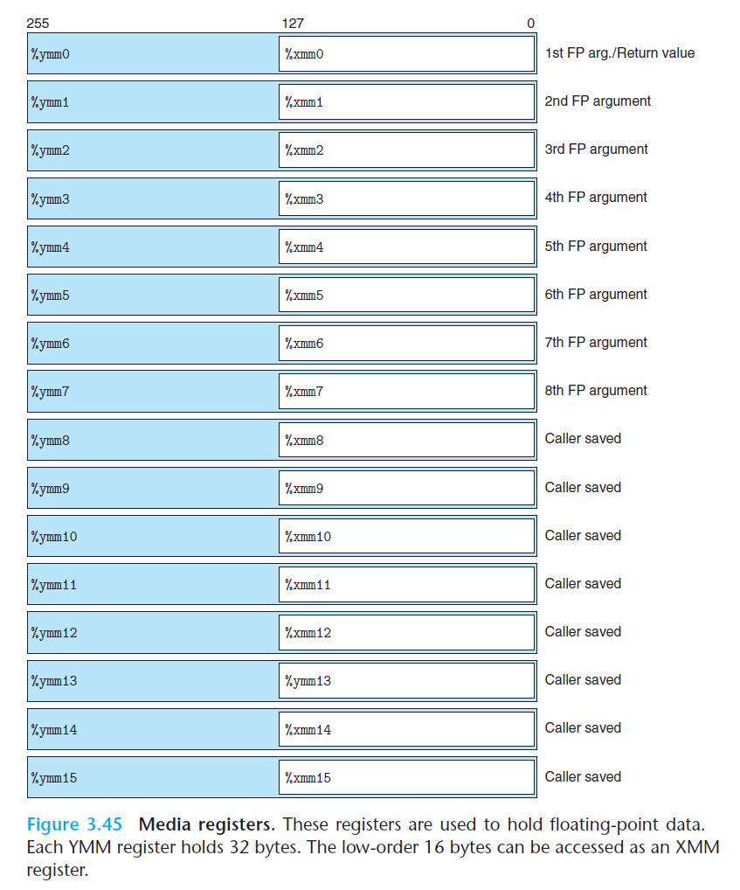

# Ch3 Machine-Level Representation of Programs

## 3.11 Floating-Point Code

浮点数和其他数据类型一样，都需要关注以下问题：

* 如果存储和访问浮点数值，通常由寄存器来完成；
* 如何操作浮点数；
* 向函数传递浮点数参数、从函数返回浮点数结果的规则；
* 函数调用过程中寄存器保存的规则，caller save and callee save。

x86-64 的浮点数体系结构的发展：

| Name                            | Register Name | Length   |
| ------------------------------- | ------------- | -------- |
| MMX                             | MM            | 64 bits  |
| SSE (Streaming SIMD Extension)  | XMM           | 128 bits |
| AVX (Advanced Vector Extension) | YMM           | 256 bits |

其中：

* 每个 YMM 寄存器可以存放 8 个 32 位值，或者 4 个 64 位值，这些数值可以为整数或者浮点数；

* 从 SSE2 以后，加入了对标量浮点数据进行操作的指令，可以使用 XMM 和 YMM 寄存器的低 32 位或者 64 位 中的单个值；

* AVX 的浮点寄存器为 `%yum0 ~ %yum15`，每个 YMM 处理器是 256 bits（32 bytes）；

    

