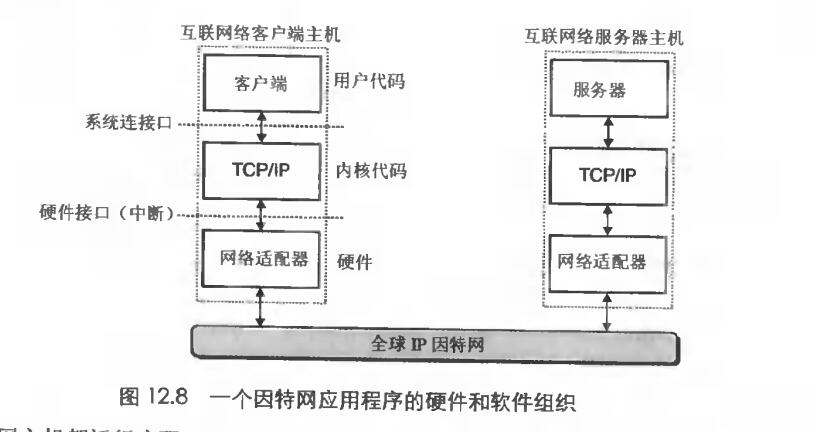

# Chapter.11 网络编程

pre Chapter 3.7

--------------

## 11.3 全球IP因特网



上图即是至目前为止基于因特网用的最广泛的客户端-服务器基本组织形式

客户端的一个进程通过系统调用来调用TCP/IP函数,TCP/IP通过中断异常向网络适配器发送消息,网络适配器封帧后传到局域网,后面流程和上以节一样

TCP/IP是一个协议族,其中每一个都提供不同的功能,例如,IP协议提供基本的命名方法和递送机制(`只能主机到主机`).即发送`数据包`,但IP是`不可靠的`,因为如果数据丢失,IP协议`无法恢复`.UDP扩展了IP,使得包可以在进程间通信,而非主机间.

TCP是一个构建在IP上更复杂的协议,提供了进程间可靠的`全双工(即双向的)`连接。

只针对TCP/IP:  
> 我们可以把因特网看做一个世界范围的主机集合.满足以下特性:  

- 每个主机集合有一组32位的IP地址
- 这组IP地址被映射为一组称为`因特网域名`的标识
- 一个因特网主机上的进程能够通过一个`连接`和其他因特网主机上的进程通信


### 11.3.1 IP地址

```cpp
struct in_addr{
    unsigned int s_addr;
};
```

用结构体存放标量IP地址是一个历史问题,因为大家都在用,所以解决不了了.

TCP/IP定义了`一致的网络字节排序`:  
**大端字节排序**  
比如IP地址,被放在包头,并且以大端法顺序存放,如果主机使用小端法.可以用下面的函数转换(Unix)

```cpp
#include<netinet/in.h>
unsigned long int htonl(unsigned long int hostlong);
unsigned short int htons(unsigned short int hostshort);

unsigned long int ntonl(unsigned long int netlong);
unsigned short int ntons(unsigned short int netshort);
```

IP用点分十进制来表示,比如 128.2.194.242(八位一个十进制) -> 0x8002c2f2(32位十六进制)

之间互相转换的代码如下:  

```cpp
#include<arpa/inet.h>

int inet_aton(const char *cp,struct in_addr *inp);  //成功为1.失败为0
char *inet_ntoa(struct in_addr in); //a是点分十进制,指向它的字符串,a是application,n是network

```


### 11.3.2 因特网域名

域名是一棵树

树的每个节点反向到根的路径就是域名

- 第一层是空节点
- 第二层是`第一层域名`,由ICANN组织定义,比如`com,edu,gov,org,net`等
- `第二层域名`,比如`com.edu`,是由ICANN授权代理的人来分配的

在1988年之前,互联网域名和ip的映射都是通过`HOSTS.txt`来手工维护的,后面出现了`DNF`(域名系统,全世界范围的数据库)  

DNS数据库每一条的结构如下:  

```cpp
struct hostent{
    char *h_name;   //域名
    char **h_aliases;  //一连串域名,一个字符串数组
    int h_addrtype; //主机地址类型((AF_INET))
    int h_length;   //主机地址长度
    char **h_addr_list; //一连串主机地址,一个字符串数组
}
```

因特网应用程序通过调用`gethostbyname`和`gethostbyaddr`,从DNS数据库中检索任意的主机条目

```cpp
#include<netdb.h>
struct hostent *gethostbyname(const char* name);
struct hostent *gethostbyaddr(const char* addr,int len,0);
```

### 12.3.3 因特网连接

因特网客户端和服务端通过在`连接`上发送和接收字节流来通信。  

`套接字socket`是连接的端点。每个套接字都有相应的套接字地址，由`地址,端口`组成.客户端发起连接请求时,端口是由内核自动分配的.称为`临时端口`

一个`连接`是由它两端的套接字地址唯一确定,这对套接字地址叫`套接字对(socket pair)`  

<cliaddr:cliport,servaddr:servport>


上面这个套接字对可以`唯一确定`一个连接


--------------


> Latex转Svg

https://www.latexlive.com/