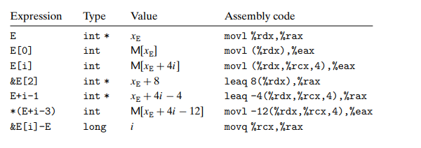

## 3.8 Array Allocation and Access

### 3.8.1 Basic Principles

对于 `T A[N]`而言，这个声明有两个作用:分派一个连续的区域L*N字节，器中L是数据类型的长度。第二，引入一个识别符号A，可以用于指向这个数组的起始位置。

对于x86-64架构而言，memory referencing指令设计成简化数组的访问，比如说，我们有E[i], E的地址存储在%rdx, i存储在%rcx，那么指令

`movl (%rdx, %rcx, 4), %eax` 就会执行x+4i,然后读取那个位置的数据，并把结果拷贝到%eax中。

### 3.8.2 Pointer Arithmetic

结合上个例子，我们可以给出给多的操作

### 习题3.37

short P:%rdx  i:%rcx 并将结果存放在%rax中

|  Expression| Type     | Assembly code|
| ------- | ---------- | ---------|
| P[1]   |  short      | movw 2(%rdx), %ax|
| P + 3 + i | short*   | leaq 6(%rdx, %rcx, 2), %rax|
| P[i * 6 - 5] | short | 不会 答案是movw -10(%rdx, %rcx, 12), %ax, 感觉答案有问题，12应该是不能直接乘的|
| &P[i + 2] | short*   | leaq 2(%rdx, %rcx), %rax 答案是 leaq 4(%rdx, %rcx, 2), %rax|
