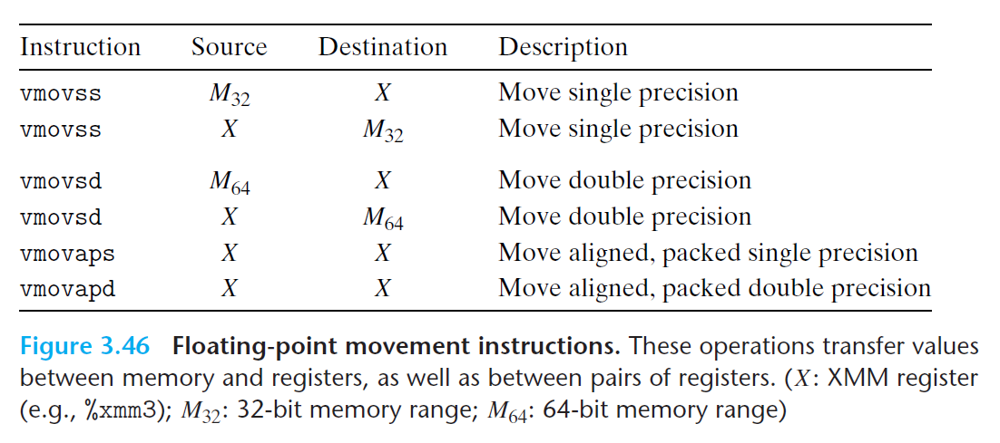
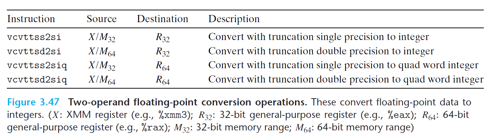
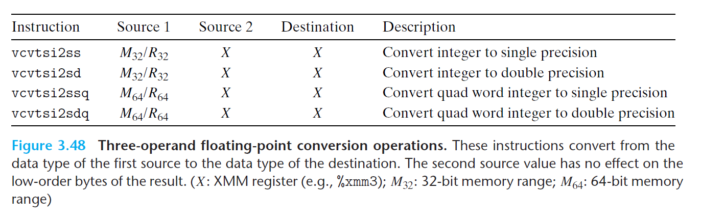

# Ch3 Machine-Level Representation of Programs

## 3.11 Floating-Point Code

**浮点传送和转换操作**

浮点数传送指令：内存和 XMM 寄存器之间、一个 XMM 寄存器到另一个 XMM 寄存器且不做任何转换。

* 无论数据是否对齐，上述指令都能正常执行；但代码优化规则建议 32 位内存数据满足 4 字节对齐，64 位内存数据满足 8 字节对齐；
* 内存引用的指定方式和 MOV 指令一致，都包括偏移量、基址寄存器、变址寄存器、以及扩大因子这四者的组合。
* 操作单精度或者双精度浮点数，程序复制整个寄存器还是复制寄存器低位不会影响程序功能、不会影响执行速度。

浮点数和整数的相互转换

* 双操作数浮点数转换指令：将浮点数转换为整数

	

* 三操作数浮点转换指令：整数转换为浮点数、浮点数之间精度的互转

    

