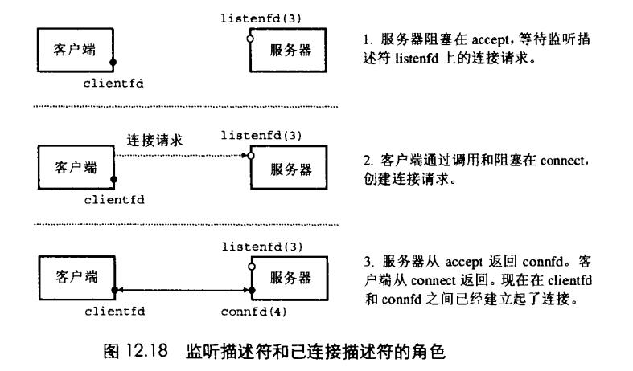

# Chapter.11 网络编程

pre Chapter 3.7

--------------

## 11.4 套接字接口

### Socket地址结构

从Linux内核角度来看,一个Socket就是痛心的一个端点,从Linux程序的角度来看,Sokcet就是一个有相应描述符的打开文件  

因特网的Socket地址存放在`sockaddr_in`的16字节结构体中

```cpp
/*IPsocket地址结构*/
struct sockaddr_in{
    uint16_t sin_family;    //协议友元,始终是AF_INET
    uint16_t sin_port;      //大端法存放端口
    struct in_addr sin_addr;//大端法存放IP
    unsigned char sin_zero[8];
};

//通用的套接字地址结构,(用于connect,bind和accept)
struct sockaddr{
    uint16_t sa_family; //协议友元
    char sa_data[14];   //地址数据
};

```

> Tip: `_in`是`internet`的缩写,而不是输入`input`的缩写


--------------

### socket函数

```cpp
#include<sys/types.h>
#include<sys/socket.h>

int socket(int domain,int type,int protocol);

//成功返回非负描述符

```

--------------

### connect函数

客户端通过调用`connect`函数来建立和服务器的连接

```cpp
#include<sys/socket.h>
int connect(int clientfd,const struct sockaddr *addr,socklen_t addrlen);
//成功返回0
```

connect函数会阻塞,试图与addr的服务器建立一个因特网连接,  
如果成功,则会得到由套接字对  
<x:y,addr.sin_addr:addr.sin_port>

x是客户端IP地址,y是临时端口

--------------

### 服务端需求函数

#### bind函数

```cpp
int bind(int sockfd,const struct sockaddr *addr,socklen_t addrlen);
```

告诉`内核`将addr中的服务器套接字地址和套接字描述符`sockfd`联系起来  
参数addrlen就是sizeof(sockaddr_in)


#### listen函数

```cpp
int listen(int sockfd,int backlog);
```

服务器调用listen函数告诉内核,描述符是被服务端而不是客户端使用的

#### accept函数

```cpp
int accept(int listenfd,struct sockaddr *addr,int *addrlen);
```

accept返回一个`已连接描述符` connfd



**上面是一个连接过程,我们之前看到的函数里都有listenfd和clientfd**  
现在就解释下这些`描述符`  
listenfd是服务端描述符,描述符`0~2是预留给标准文件的`  
上图中,我们设定描述符为`3`  

- 客户端调用connect函数,发送一个请求连接给`listenfd`,
- accept函数打开了一个新的已连接描述符`connfd`,在clientfd和connfd之间建立连接,返回connfd给应用程序,客户端也从connect返回
- 之后便可以分别通过读和写clientfd和connfd来回传送数据


--------------


> Latex转Svg

https://www.latexlive.com/