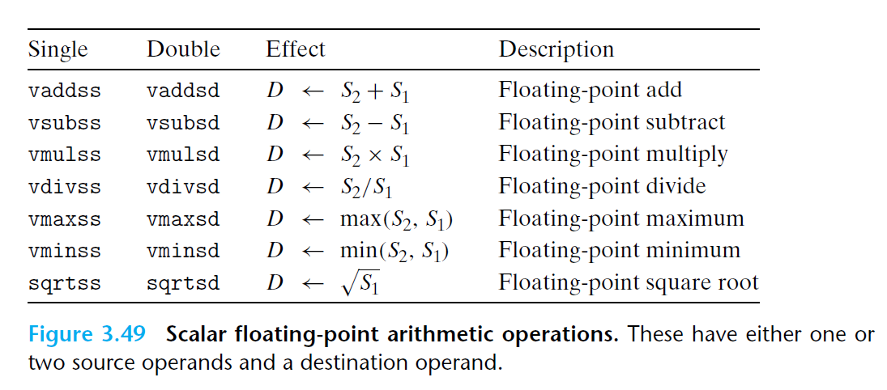

# Ch3 Machine-Level Representation of Programs

## 3.11 Floating-Point Code

**过程中的浮点代码**

和常规类型的通用寄存器类似，XMM 寄存器用来向函数传递浮点参数，以及从函数返回浮点值。规则如下：

* XMM 寄存器通过 `%xmm0 ~ %xmm1` 最多可以传递 8 个浮点参数，按照参数列出的顺序使用这些寄存器，额外的浮点参数可以通过栈来传递；
* 函数使用 `%xmm0` 来返回浮点值；
* 所有的 XMM 寄存器都是 caller save 的，被调用者可以不保存就覆盖这些寄存器；

**浮点运算操作**

算数操作的 AVX2 指令，每条指令有一个或两个源操作数（$S_{1}、S_{2}$），以及一个目的操作数（$D$）。其中，源操作数 $S_{1}$ 可以时一个 XMM 寄存器其或一个内存位置，第二个操作数和目的操作数都必须是 XMM 寄存器；每个操作都有单精度版本和高精度版本。

