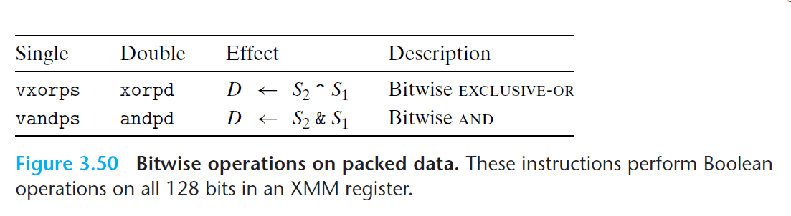
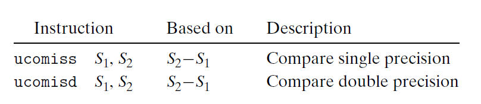

# Ch3 Machine-Level Representation of Programs

## 3.11 Floating-Point Code

**浮点常数**

AVX 浮点操作不能使用立即数作为操作值，编译器必须为浮点数常量分配存储空间、初始化，在使用时再将值从内存读入。

**浮点数位运算**

**浮点数比较**

和 cmp 指令类似，AVX2 也提供了用于浮点数比较的指令。

* 操作数顺序和 ATT 风格汇编相反；操作数 $S_{2}$ 必须在 XMM 寄存器中，操作数 $S_{1}$ 可以在 XMM 寄存器或内存中。
* 浮点数比较指令同样设置条件码：零标志位 ZF、进位标志位 CF 和 奇偶标志位 PF；
    * 整数类型中，如果最近一次算数或逻辑运算产生的值的最低位字节有偶数个 1，则 PF 位置为 1；
    * 浮点类型中，如果两个操作数中出现了一个 $NaN$，PF 会被置位；
    * jp：jump on parity。

