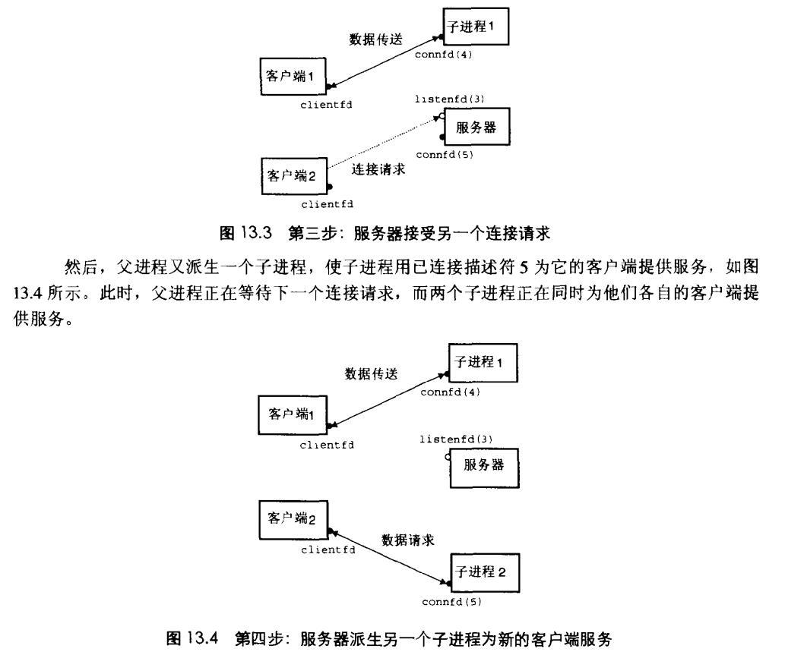
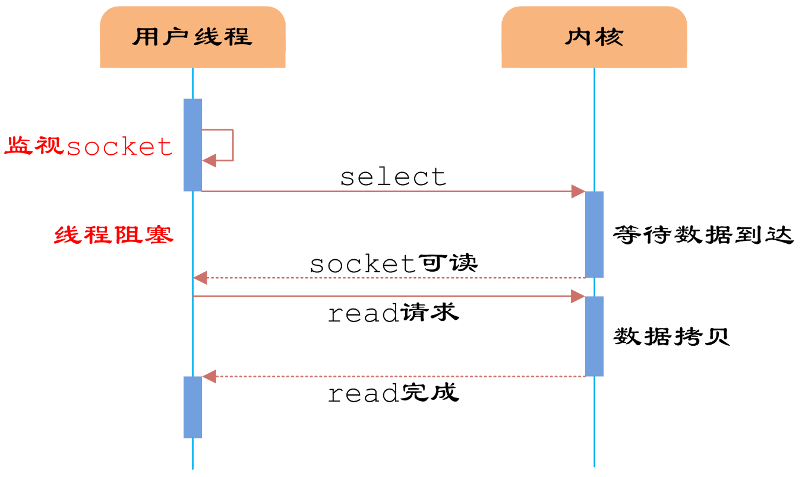

# Chapter.12 并发编程

pre.3

--------------

## 三种并发程序

- 进程: 每个逻辑流都是一个进程,由内核来调度和维护。因为进程有独立的`虚拟空间`，所以想要和其他进程通信,就必须通过`IPC`
- I/O多路复用
- 线程: 线程是运行在一个单一进程上下文中的逻辑流,由内核调度,但是,一个进程内的不同线程共享一个虚拟空间

--------------

## 基于进程的并发

> 在前面的网络部分,我们知道客户端与服务端是通过`监听描述符`和`连接描述符`来完成的
>> 客户端连接到服务端后,并且分配完子进程后,主进程必须释放子进程持有的`连接描述符`,否则可能触发内存泄漏

一个简单的连接模型如下图所示:  

需要注意的是,因为服务端需要运行很长时间,`所以必须处理僵死进程 监听 SIGCHILD 信号`

连接关闭是有一个引用计数的,所以必须父子进程的`clientfd`都关闭,才会断开连接

> 进程的优劣

1. 进程之间虚拟空间互相独立,这点很好,一个进程不会不小心覆盖了其他进程内容

2. 进程控制和IPC消耗非常大

--------------

## 基于I/O多路复用的并发编程

看到一篇文章讲得很好:  

https://www.cnblogs.com/yanguhung/p/10145755.html

大概流程类似于上面,只不过,在监听socket阶段,可以同时监听很多连接,某个连接到来时,调用select进入执行阶段

但是进入执行阶段后,仍然是会阻塞的

基于这个之上,存在一个`Reactor`的I/O多路复用配合线程的方式.

如上图,可以发现,数据的读取并不会阻塞主进程,会开启一个新的线程进行处理等待

--------------

## 基于线程的并发编程

每个线程都有自己的线程上下文:  

- `唯一整型线程ID`
- `栈`
- `栈指针`
- `程序计数器`
- `通用目的寄存器`
- `条件码`

所有运行在一个进程里的线程共享该进程的整个虚拟地址空间

线程的上下文要比进程上下文`小得多`,而且线程没有严格的父子关系,所以效率上比进程要好得多

--------------

> Latex转Svg

https://www.latexlive.com/