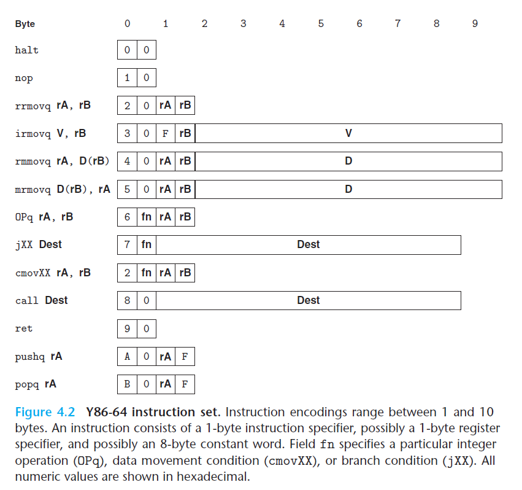

# Ch4 Processor Architecture

第四章主要内容：

* 指令集体系结构（Instruction-Set Architecture， ISA），ISA 在编码器编写者和处理器设计者之间提供了抽象层，使得编译器编写者只需要知道指令及其编码，当处理器设计者需要设计这令；
* 数字硬件设计；
* 流水线化的处理器设计。

## 4.1 The Y86-64 Instruction Set Architecture

本节用 Y86-64 来介绍 ISA 的设计。Y86-64 和 X86-64 类似，定义了各种状态单元、指令集及其编码、以及编程规范和异常事件处理。

**程序员可见状态**

* 15 个寄存器（除去了 `%r15` 的x86-64 的寄存器），每个寄存器长度为 64 bit；
* 条件码（zero flag、sign flag、overflow flag）；
* PC（rip）；
* Stat：程序状态；
* DMEM：内存，Y86-64 使用虚拟地址，仍需 MMU 转换为物理地址来使用。

**Y86-64 指令**

Y86-64 为 X86-64 的一个子集，只包括 8 字节整数操作、寻址方式和操作方式少。

**指令编码**

每条指令需要 1 到 10 个字节来用于实现字节级别的编码。

* 第一个字节是指令的类型，高 4 bit 是 code 部分，低 4 bit 是 function 部分；

* 寄存器的编码为 `0 - E`，在需要寄存器访问的指令中，指令的编码会有附加的寄存器指示符字节（register specifier byte）来指定寄存器访问；
* 有些指令需要一个附加 4 字节常数字（constant word），可作为立即数、地址指示符的偏移量、跳转指令的地址。

指令编码的关键在于字节编码必须有唯一的合法解释，这样就使得处理器能无二义性的执行目标代码，能无差错的确定指令序列。

