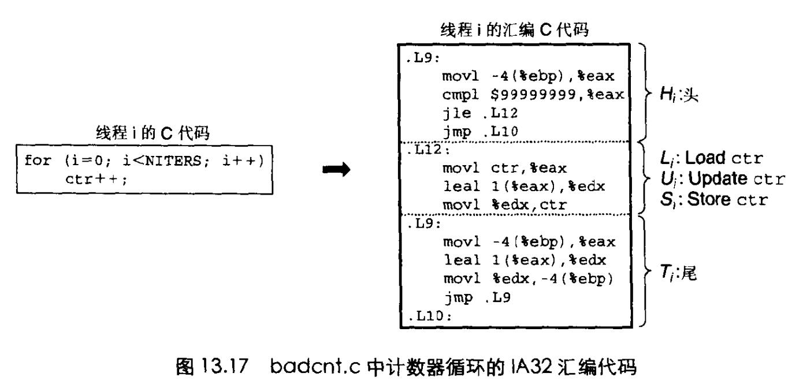

# Chapter.12 并发编程

pre.3

--------------

## 多线程共享变量

### 线程内存模型

一组并发的线程运行在同一个`进程上下文里`,每个线程都有自己独立的`线程上下文`  
包括:  
- 线程ID
- 栈
- 栈指针
- 程序计数器
- 条件码
- 通用目的寄存器值

线程间`不能互相访问其自身的寄存器值`,但是`一组并发的线程却共享同一套虚拟内存空间(进程)`  

所以线程通常而言是有可能`访问到其他线程的栈指针的,(比如全局变量)`.那么它就可能破坏掉其他线程的运行结果

### 将变量映射到内存

- 全局变量: 运行时分配在主线程虚拟内存中,全局可访问
- 本地自动变量: `没有static`,但是线程内部的(局部变量一类的)都是线程独有的
- 本地静态变量: 比如一个函数,里面有一个static,那么所有的线程都可以访问到这个static

### 共享变量

有时候偶本地变量也可能会被共享,`比如一个全局指针指向了局部变量`


--------------


## 用信号量同步线程

`共享变量`有时候可能会触发`同步错误`的问题。

```cpp
#include "csapp.h"

void *thread(void *vargp);

volatile long cnt = 0;

int main(int argc,char **argv){
    long niters;
    pthread_t tid1,tid2;

    if(argc != 2){
        printf("usage: %s <niters>\n",argv[0]);
        exit(0);
    }
    niters = atoi(argv[1]);

    Pthread_create(&tid1,NULL,thread,&niters);
    Pthread_create(&tid2,NULL,thread,&niters);
    Pthread_join(tid1,NULL);
    Pthread_join(tid2,NULL);

    if(cnt != (2*niters)){
        printf("BOOM! cnt=%ld\n",cnt);
    }else{
        printf("OK cnt=%ld\n",cnt);
    }
    exit(0);
}

void *thread(void *vargp){
    long i,niters = *((long*)vargp);
    for(i =0;i<niters;++i){
        cnt++;
    }
    return NULL;
}

```


上述代码理想逻辑是cnt加了2*niters次,但是结果却不是.

上面线程的for循环的代码可以拆成一下几条  
- Hi:在循环头部的指令块
- Li:加载共享变量cnt到累加寄存器`%rdxi`的指令,这里`%rdxi`表示线程i中的寄存器`%rdx`的值
- Ui:更新(增加)`%rdxi`的指令
- Si:将%rdx的更新指令存回到共享变量`cnt`的指令
- Ti: 循环尾部的指令块

注意,`%rdxi`的值是cnt的拷贝值,到最后才会重新加回去

汇编代码如下:  



**因为我们无法预测操作系统什么时候执行更新/加载/存储的指令,因为这段代码是分时间片执行的**

而这种指令互相穿插,就会导致**共享变量出错**


--------------


> Latex转Svg

https://www.latexlive.com/