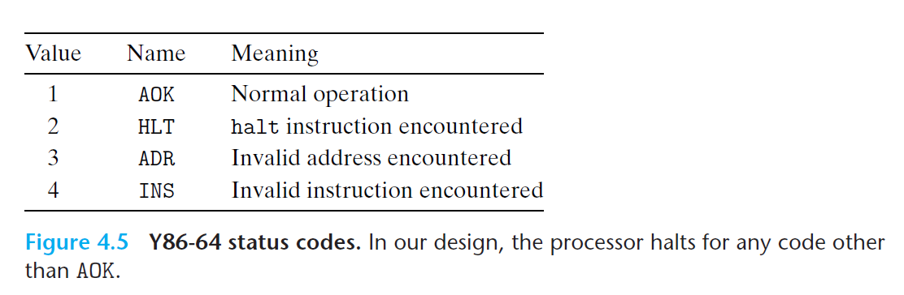

# Ch4 Processor Architecture

## 4.1 The Y86-64 Instruction Set Architecture

**Y86-64 异常**

Y86-64 有一个对程序员可见的状态码 Stat，描述了程序执行的总体状态。

Y86-64 遇到异常时，会使处理器停止执行指令。在其他更完整的设计中，处理器通常会调用一个异常处理程序，这个异常处理程序可以是中断或者信号。

**Y86-64 程序**

书上举例了一个 Y86-64 汇编码到机器代码的转换。介绍了栈的位置、数据和程序初始化以及程序结束的相关问题。

**Y86-64 入栈和退栈的方法**

pushq 指令会把 `%rsp` 减 8，并且将寄存器值写入内存中，但是这个顺序并不明确，可以是以下的两种方式：

1. 压入 `%rsp` 的原始值，然后再减去 8；
2. 先将 `%rsp` 减去 8，然后再压入栈内存中。

Y86-64 和 X86-64 都是采用的第一种方法。

同样，popq 指令也存在类似问题。popq 指令会先增加 8，然后退栈。

