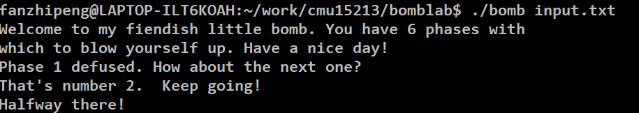

## bomblab 1-3

完成了前三个小问题，一开始尝试在mac m1 arm架构上做，发现不太行，因为gdb没法子用，可能需要装一个x86_64的gdb，折腾了不少时间没搞定，遂还是用windows x86写了qaq。



## bomb1

```
0000000000400ee0 <phase_1>:
 347   400ee0:   48 83 ec 08             sub    $0x8,%rsp
 348   400ee4:   be 00 24 40 00          mov    $0x402400,%esi
 349   400ee9:   e8 4a 04 00 00          callq  401338 <strings_not_equal> // 比较是根据(%rdi) 和 (%rsi) 的两个字符串，所以只需要查看 x/s 0x402400
 350   400eee:   85 c0                   test   %eax,%eax
 351   400ef0:   74 05                   je     400ef7 <phase_1+0x17>
......
```

## bomb2
```
0000000000400efc <phase_2>:
 357   400efc:   55                      push   %rbp
 358   400efd:   53                      push   %rbx
 359   400efe:   48 83 ec 28             sub    $0x28,%rsp
 360   400f02:   48 89 e6                mov    %rsp,%rsi
 361   400f05:   e8 52 05 00 00          callq  40145c <read_six_numbers> // 顾名思义
 362   400f0a:   83 3c 24 01             cmpl   $0x1,(%rsp)
 363   400f0e:   74 20                   je     400f30 <phase_2+0x34>
 364   400f10:   e8 25 05 00 00          callq  40143a <explode_bomb>    // 第一个不是1不行
 365   400f15:   eb 19                   jmp    400f30 <phase_2+0x34>
 366   400f17:   8b 43 fc                mov    -0x4(%rbx),%eax
 367   400f1a:   01 c0                   add    %eax,%eax
 368   400f1c:   39 03                   cmp    %eax,(%rbx)              // eax = -0x4(%rbx) 并且需要相等 也就是当前值是前一个值的两倍 所以就是一个等比数组
 369   400f1e:   74 05                   je     400f25 <phase_2+0x29>
 370   400f20:   e8 15 05 00 00          callq  40143a <explode_bomb>
 371   400f25:   48 83 c3 04             add    $0x4,%rbx
 372   400f29:   48 39 eb                cmp    %rbp,%rbx               // 每轮循环rbp+4
 373   400f2c:   75 e9                   jne    400f17 <phase_2+0x1b>
 374   400f2e:   eb 0c                   jmp    400f3c <phase_2+0x40>   // 循环的末尾是rbp == 0x18 即 ((0x18 - 4 - 0) / 4)6次
```

## bomb3


```
 384   400f43:   48 83 ec 18             sub    $0x18,%rsp
 385   400f47:   48 8d 4c 24 0c          lea    0xc(%rsp),%rcx
 386   400f4c:   48 8d 54 24 08          lea    0x8(%rsp),%rdx
 387   400f51:   be cf 25 40 00          mov    $0x4025cf,%esi // x/s 0x4025cf = "%d %d"
 388   400f56:   b8 00 00 00 00          mov    $0x0,%eax
 389   400f5b:   e8 90 fc ff ff          callq  400bf0 <__isoc99_sscanf@plt> // 传2个参数 将文件中的两个数 分别放到0xc(%rsp) 和 0x8(%rsp)中
 390   400f60:   83 f8 01                cmp    $0x1,%eax
 391   400f63:   7f 05                   jg     400f6a <phase_3+0x27>
 392   400f65:   e8 d0 04 00 00          callq  40143a <explode_bomb>
 393   400f6a:   83 7c 24 08 07          cmpl   $0x7,0x8(%rsp)       // 第一个参数和7比较
 394   400f6f:   77 3c                   ja     400fad <phase_3+0x6a> // 不能大于7
 395   400f71:   8b 44 24 08             mov    0x8(%rsp),%eax
 396   400f75:   ff 24 c5 70 24 40 00    jmpq   *0x402470(,%rax,8)  // 一个switch的jump table 可以x/20x 0x402470
 397   400f7c:   b8 cf 00 00 00          mov    $0xcf,%eax            // 所以一共有7个正确的组合
 398   400f81:   eb 3b                   jmp    400fbe <phase_3+0x7b>
 399   400f83:   b8 c3 02 00 00          mov    $0x2c3,%eax
......
```
