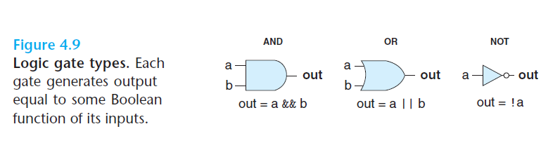

# Ch4 Processor Architecture

## 4.2 Logic Design and the Hardware Control Language HCL

实现一个数字系统的三个组成部分：

* 计算对位进行操作的函数的组合逻辑
* 存储位的存储器单元
* 控制存储器单元更新的时钟信号

**逻辑门**

逻辑门的输入不是 1 bit，是 n bit，n > 2。

**组合电路**

多个逻辑门组合形成，构建的计算块。有几个限制：

* 每个逻辑门的输入必须是以下三个中的任意一个：
    * 一个系统输入（主输入）
    * 某个存储器单元的输出
    * 某个逻辑门的输出
* 两个或多个逻辑门的输出不能连接在一起。
* 组合形成的计算块必须是无环的。