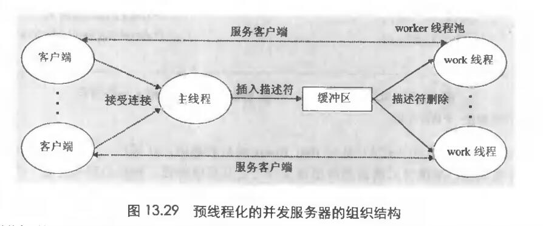

# Chapter.12 并发编程

pre.3

--------------

## 饥饿问题

书中给的例子是生产者-消费者模式下的饥饿问题

这里用哲学家就餐问题来解释

一个桌子上有五个哲学家,五个盘子,五个叉子,哲学家必须拿到两个叉子才可以就餐,就餐结束后哲学家会把叉子放回去,并且思考一段时间,再次尝试就餐.

这样就产生一个问题,如果五个哲学家每个人只请求到一个叉子,就会陷入到死锁/饥饿的状态

编程建模就是:  

哲学家1请求叉子4,成功,接着请求叉子0  
哲学家2请求叉子3,成功,接着请求叉子1  
哲学家3请求叉子2,成功,接着请求叉子2  
哲学家4请求叉子1,成功,接着请求叉子3
哲学家5请求叉子0,成功,接着请求叉子4

以上请求均用`P/V`进行阻塞

可以发现,每个人现在手上都有一个叉子,同时在请求别人拥有的叉子.陷入饥饿

## 基于预线程化的并发服务器

前提:  `如果每个客户端进来都要建立一个新的线程这个代价是不小的`

所以就将系统拆分成 `主线程和一组工作线程`

主线程不断地接收来自客户端的请求,然后将得到的连接描述符放到一个有限缓冲区中。  
每个工作线程不断地从缓冲区中取出描述符,为客户端服务,然后等待下一个描述符

## 其他并发问题

### 线程安全

- 1. 不保护共享变量的函数
- 2. 保持跨越多个调用的状态的函数(比如单线程多次用一个seed调用随机函数可以得到确定序列,但是如果多线程这个结果就无法保证了)
- 3. 返回指向静态变量的指针的函数,因为返回的是指针而不是值,所以可能指针里的内容被其他线程覆盖
- 4. 调用线程不安全函数的函数

### 可重入性

可重入函数`不会有任何线程共享变量`,所以可以放心调用,比如如果函数所有的值都是在`本地自动栈变量,即没有引用全局或者静态`,就是显示可重入

隐式可重入意思是,确保传入的引用一定是线程安全的

### 内置函数

`malloc,free,realloc,printf,scanf`都是线程安全的

...

### 竞争

首先一个准则`多线程程序必须保证任何可行的轨迹都能正确工作`

如果破坏了这个准则,比如一个程序的正确性需要依赖`一个线程到达x点时另一个线程不能到达y点`,这样就产生了竞争问题 

意思就是,访问同一个变量的时机出现了错误

### 死锁

之前有说过一个饿汉死锁

--------------

> Latex转Svg

https://www.latexlive.com/