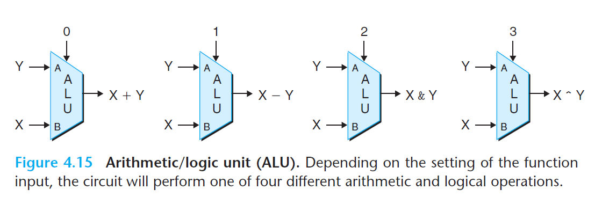

# Ch4 Processor Architecture

## 4.2 Logic Design and the Hardware Control Language HCL

**Word-Level Combinational Circuits and HCL Integer Expressions**

设计对 字（words）级别进行操作的电路，会根据输入字的各个位，用逻辑门来计算输出字的各个位。

多路复用器能跟根据某些控制条件，从多个源中选出一个字：

```
[
    select1 : expr1;
    select2 : expr2;
    ...
    selectk : exprk;
]
```

和 C switch-case 语句的区别：

* C 中的 case 要求不同选择之间是互斥的；HCL 则不要求，按照顺序求值，如果第一个求值为 1，则会被选中；


CPU 中的 ALU 就是由组合逻辑电路设计的。Y86-64 的 ALU 有三个输入：A 和 B 的数据输入，控制输入。



