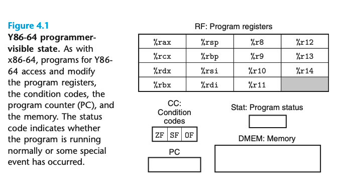

# 4 Processor Architecture

为了简便，教材中采用了一种y86-64的指令集，并且先后设计单周期和五级流水线的cpu

## 4.1 The y86-64 Instruction Set Architecture

### 4.1.1 Programmer-Visible State

定义一个指令集，需要定义若干个不同的组件，如指令是哪些，他们的编码规则是怎么样的，如何处理异常等等。

y86-64架构省略了15为了编码的简便性。但保留condition code以及stat用来描述异常。

### 4.1.2 Y86-64 Instructions

Y86-64有一些规定，如把movq拆成irmovq, rrmovq, mrmovq, and rmmovq 因为x86本身就不支持memory到memory，所以y86也维持同样的。并且y86
为了简化，摒弃了复杂的寻址方式。

y86-64的指令集只有很少的几条,比较简单。

