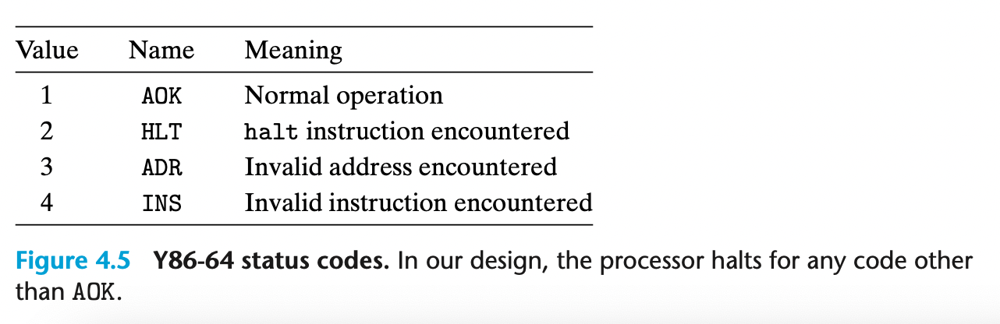

### 4.1.3 Instruction Encoding

每个指令的编码一开始是一个code+function, function是只有一些指令才有的，比如jxx，bxx等

每个寄存器对应一个register identifier，范围是0-0xe 因为一共只有15个寄存器，0xf意味着 不需要寄存器。

y86-64架构中只用绝对寻址，而不包含pc相对寻址，这减少了复杂性。

一个重要的特性是，任何一个指令集的某个指令必须是确定唯一的含义。

## Aside RISC and CISC ISA

risc: reduced instruction set computer

cisc: complex instruction set computer

一般而言 risc指令更少，编码后的长度固定，简单的寻址方式，对于逻辑数字运算只能用于register，load->op->store,没有condition code

在embedded system上，risc(arm)市场份额很大

### 4.1.4 Y86-64 异常

使用寄存器Stat来描述

