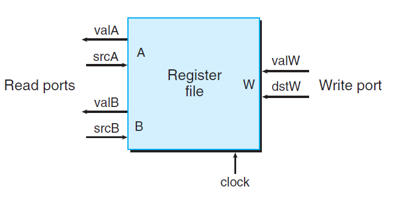
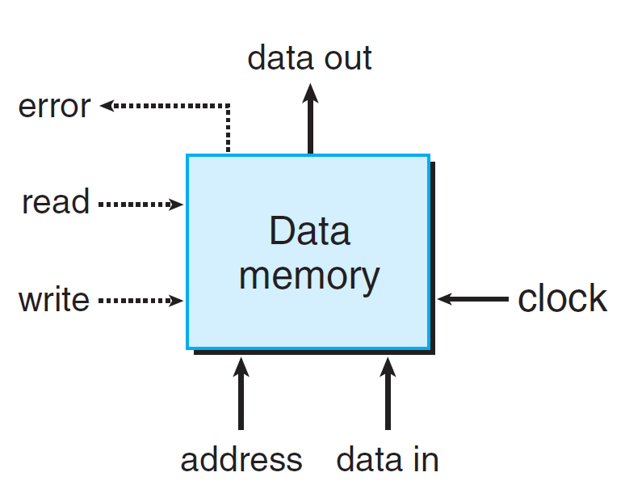

# Ch4 Processor Architecture

## 4.2 Logic Design and the Hardware Control Language HCL

**存储器和时钟**

组合电路不存储任何信息，只是相应输入信号，产生某个具体的输出。为了产生时序电路（即存在状态，根据状态进行计算的系统），必须引入按位存储信息的设备：

* clocked registers：时钟寄存器，存储单个位或字，时钟信号控制寄存器加载输入值；
* random access memories：内存，针对某个具体的地址来进行读操作或写操作，包括针对虚拟内存的访问和寄存器的访问。

> 真实的存储器系统要更复杂，其包括多种硬件存储器，包括 RAM，磁盘，以及相关的硬件和软件机制。

硬件寄存器的工作状态：

只有在每个时钟达到上升沿时，值才会从寄存器的输入传送到输出。Y86-64 中，使用始终寄存器保存程序计数器PC、条件码 CC、程序状态 Stat。

寄存器文件：

* 一个寄存器文件有两个读端口和一个写端口，多端口随机访问存储器能允许同时进行多个读和写操作；上图中，可以同时读两个寄存器的值，同时更新第三个寄存器的状态；每个端口都有一个地址输入，表示选择哪个程序寄存器；
* 当 srcA 被设置为某个寄存器 ID 时，在一段延迟后，存储在相应寄存器的值会出现在 valA 上；
* 写入也是由时钟信号控制的，每次时钟上升沿时，输入到 valW 上的值会被写入到 dstW 的寄存器中；当我们同时读和写同一个寄存器时，会看到一个新值到旧值的变化。

Random access memories:

* 有一个地址输入 （address），一个写的数据输入（data in），一个读的数据输出（data out）；
* 在针对某个 address 数据进行读写时，需要设置好 write 控制信号，并且检查 address 内容是否越界来设置 error 信号，最后进行具体操作。

