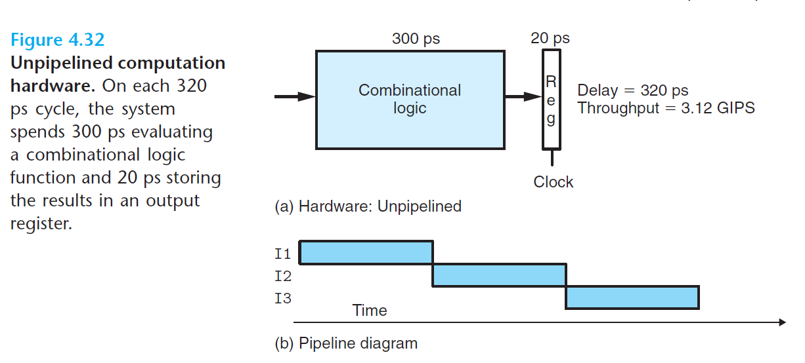
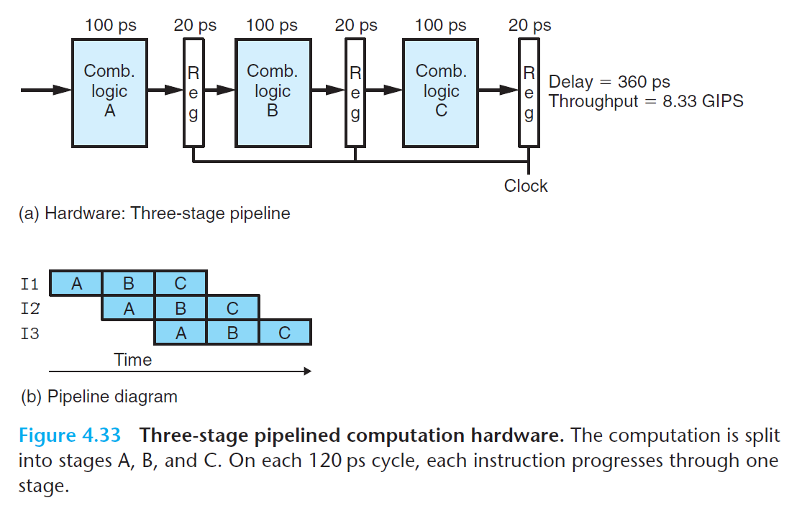
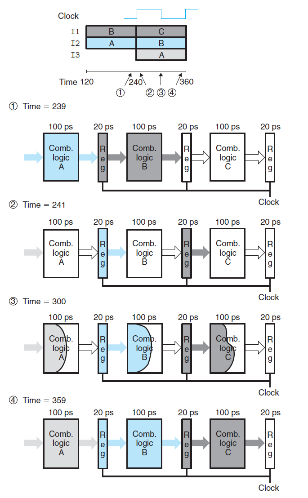

# Ch4 Processor Architecture

## 4.4 General Principles of Pipelining

使用 SEQ 时时钟必须特别慢，这样才能使得能在一个周期内传播到所有阶段；这种实现方法不能充分利用硬件单元，因为每个单元只能在整个时钟周期的部分时间段内才被使用。

为了解决上述问题，可以使得指令流水线化，流水线的两个特点是：提高系统的吞吐量（throughout）、增加了延迟（latency）。

**Computational Pipelines**

* 非流水线化

    整个指令的执行是由一个执行计算的逻辑以及一个保存计算结果的寄存器组成的。

    `ps`: picosecond，微微秒；

    `latency`：
    $$
    \text { Throughput }=\frac{1 \text { instruction }}{(20+300) \text { picoseconds }} \cdot \frac{1,000 \text { picoseconds }}{1 \text { nanosecond }} \approx 3.12 \text { GIPS }
    $$
    `GIPS`：giga-instruction per second，每秒千兆条指令（每秒十亿条指令）；

    `latency`：从头到尾执行一条指令所需的时间成为延迟，延迟为吞吐量的导数。

    

    

* 流水线化

    将系统的计算分为多个阶段，在各个阶段之间放流水线寄存器（pipeline register），每条指令计算时，需要经过三个完整的时钟周期。在稳定状态下，这样增加了吞吐量，代价是延迟的少量增加，是由增加的流水线寄存器的时间开销导致的。

    

**A Detailed Look at Pipeline Operation**

下图为流水线计算的时序和操作，从 240 ~ 360 时刻的各个阶段如下：

1. Time = 239，阶段 A 计算的 指令 I2 的值已经到达流水线寄存器的输入，指令 I1 在阶段 B 计算的值也到达了第二个流水线寄存器的输入，但是都并未更新，等待一个时钟上升信号；
2. Time = 241，时钟上升沿时，寄存器文件将上一步骤中的寄存器输入的更新为寄存器的输出；
3. Time = 300，信号传播通过各个阶段的组合逻辑，三个阶段 A，B，C 开始执行计算任务；但信号传播的速率不同；
4. Time = 359，计算结果值到达下一阶段的流水线寄存器的输入。

* 减缓时钟不会影响流水线的行为，只有时钟上升时寄存器文件才会更新值。
* 时钟周期运行太快，值可能会来不及通过组合逻辑，这样可能会导致时钟上升时，流水线寄存器的输入还不是合法的值。

通过划分为多个组合逻辑块，使用时钟寄存器，这样能够控制流水线中的指令流，随着时钟周期的变化，这样指令的执行就能通过流水线的各个阶段，不会互相干扰。

