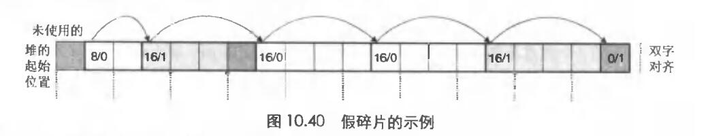
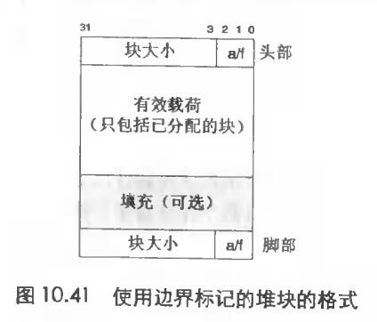
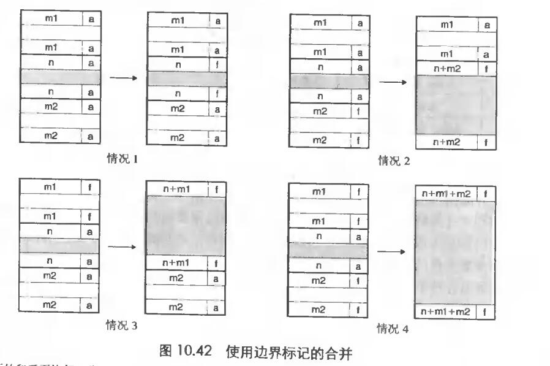

# Chapter.9 虚拟内存

---------------

## 放置已分配的块

当一个应用请求k字节的块时,分配器搜索空闲链表,查找一个可以放置所请求块的空闲块,一些常见的`放置策略`有:  
- 首次适配: 选择第一个合适的空闲块,缺点是可能留下`碎片`
- 下一次适配: 是从上一次查询结束的地方开始查找
- 最佳适配: 检查每个空闲块,选择适合所需请求大小的最小空闲块、
    - 在上一个笔记中的链式空闲链表的方式中,最佳适配可能效率并不高,因为他要遍历整个空闲链表
    - 后面会有更加精细复杂的`分离式空闲链表组织`

## 获取额外的堆内存

当在内存里无法得到一串连续的空闲块，这时候就需要做额外的处理

一种方式是合并空闲块  
但是在合并块失败后,就需要进行调用sbrk函数在堆内存上进行再次分配,并连接到当前的空闲块上

### 合并空闲块  

> `假碎片现象`: 比如如下的一个图:  

有些块释放了以后可能是连续的一些小的空闲块,所以**对于每个分配器而言,都需要实现`合并`**

`立即合并`: 空闲块释放后立即决定是否合并  
`推迟合并`: 比如分配失败以后,扫描整个堆,合并一次,快速的分配器通常选择使用这种方式

### 基于边界标记的合并

可以看到右上角有一个空闲标记

后面有四种分配逻辑

--------------

> Latex转Svg

https://www.latexlive.com/