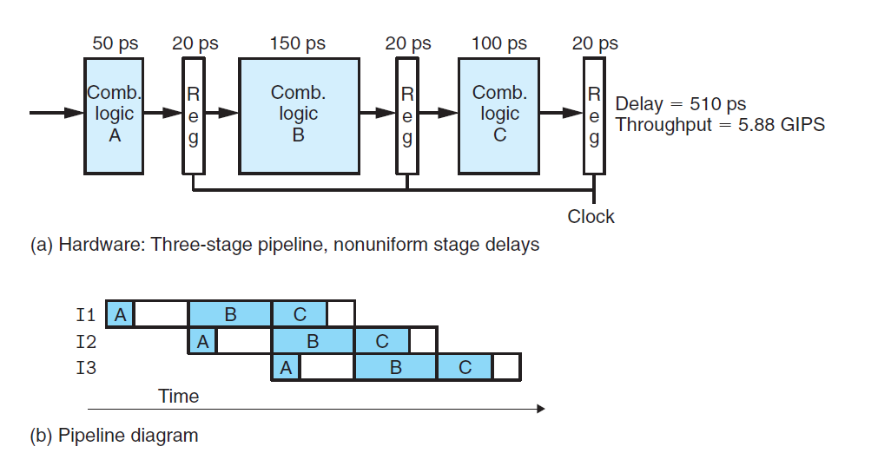
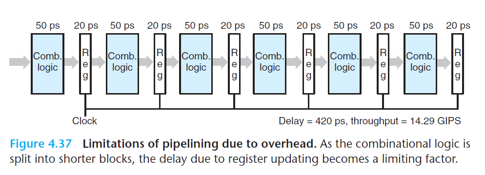
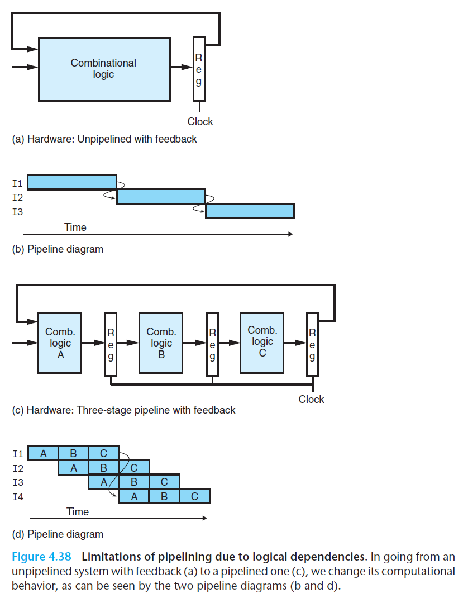

# Ch4 Processor Architecture

## 4.4 General Principles of Pipelining

**Limitation of Pipelining**

存在很多因素影响流水线的效率。

* 阶段划分不一致

    如果各阶段的延迟不一致，运行时钟的速率是由最慢的阶段限制的，其余快的阶段会等待慢阶段，从而导致吞吐量降低。

    对于硬件设计者来说，如何将指令的执行过程划分成具有相同延迟的阶段是比较难的。原因在于：处理器中的某些硬件单元，例如 ALU 和内存，是不能被划分成多个单元的，这使得各个单元的延迟平衡较为困难。当今硬件的设计，必须考虑时序优化。

    

    

* 流水线过长，导致收益降低

    下图中的六阶段流水线，和之前的相比，时钟计算的时间缩短了两倍，提升了性能，但是由于流水线寄存器的延迟，吞吐量并没有加倍。反而改延成为了流水线吞吐量的一个瓶颈。

    现代处理器为了提高时钟频率，采用了较长的流水线。因此，处理器架构师必须将指令划分为许多简单的步骤，来降低每个阶段的延迟；电路设计者必须设计好流水线寄存器来降低延迟；芯片设计者必须谨慎的设计时钟传播网络，保证时钟信号的传递。

    


**Pipelining a System with Feedback**

* 数据相关，data dependency

    寄存器 `%rax`、`%rbx` 被多次使用

    ```assembly
    irmovq %50, %rax
    addq %rax, %rbx
    mrmovq 100(%rbx), %rdx
    ```

    

* 控制相关，control dependency

    指令控制流造成的顺序相关，下面的 `jne`

    ```assembly
    loop:
        subq %rdx,%rbx
        jne targ
        irmovq $10,%rdx
        jmp loop
    targ:
        halt
    ```


如果将上述指令流水线化，引入反馈路径后，会导致改变程序原本的行为。




