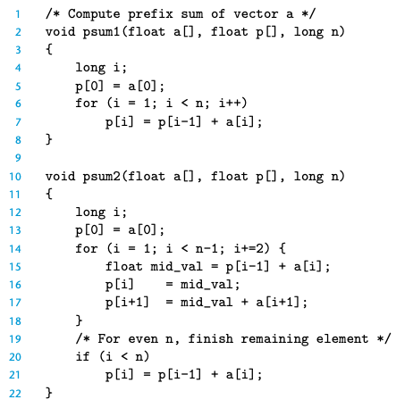

## 5.2 Expressing Program Perfprmance

CPE: cycles per element

一段代码可以通过一个常量+某个正比于循环数据量的值来测量。



对于以上代码psum1: 368 + 9.0n, psum2 368 + 6.0n

这表明他们需要368个cycle进行一些初始化的工作

## 5.3 Program Example

vector abstract type:

```c
typedef struct {
    long len;
    data_t *data;
} vec_rec, *vec_ptr;
```

这里教材给了两个测试，一个是对vec的所有的data求和，求乘积。那么结果是如果使用-O1优化，可以快2倍左右。

## 5.4 Eliminating Loop Inefficiencies

在先前的程序中每次循环都需要获取length，我们可以先求这个length，放到循环体外面，这样比-O1优化的还要快30%，20s->10s->7s

由于compiler可能不知道get_length() 可能会有一些 side effects 比如++全局变量，所以可能不会对其进行code motion的优化

这在某些情况下可能会使得算法的复杂度*n，比如length对一个char*，那么需要找到'\0',这个时候求一次length就O(N)了。


