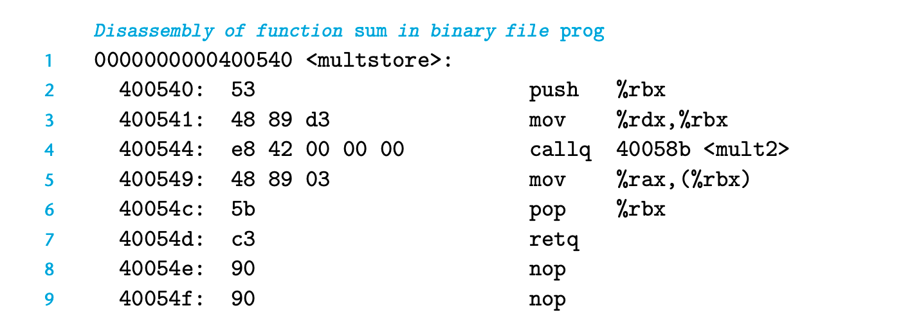
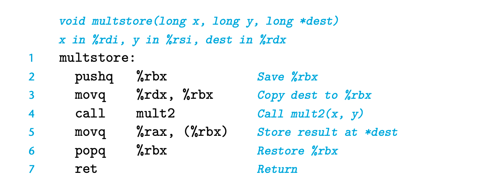
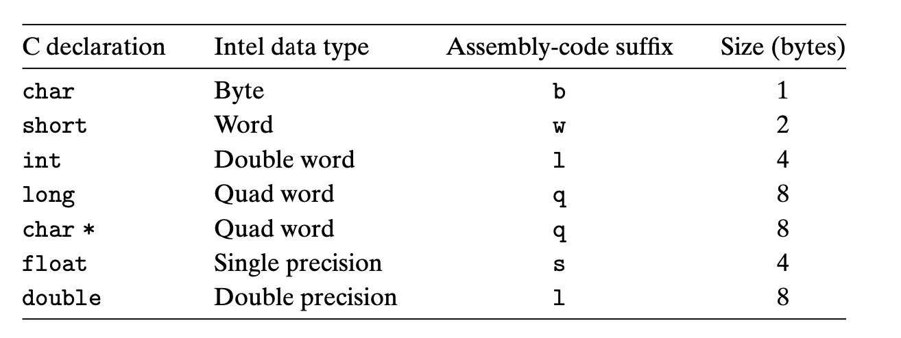
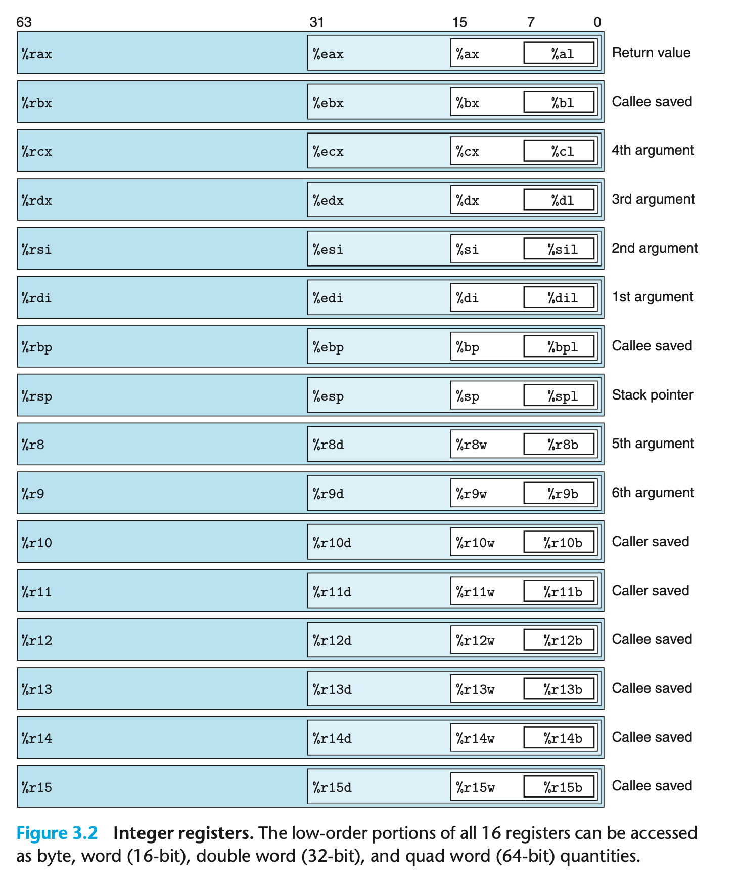

`linux> gcc -Og -o prog main.c mstore.c`

实际可运行的代码需要运行linker 其中的一个object-code文件需要包涵main函数
代码和mstore的机器码区别主要在于 linker 真的把地址填入到了机器码中
nop主要用于对齐内存；将函数变成16bytes

### 3.2.3 Notes on Formatting

# 3.3 Data Formats
word -> 16-bit
double words -> 32-bit
quad words -> 64-bit

movb -> move byte
movw -> mov word
movl -> move double word
movq -> move quad word

# 3.4 Accessing Information
x86-64 CPU -> 16 general-purpose registers storing 64-bit values
%rax %rbp --- %r8 ... %r15
