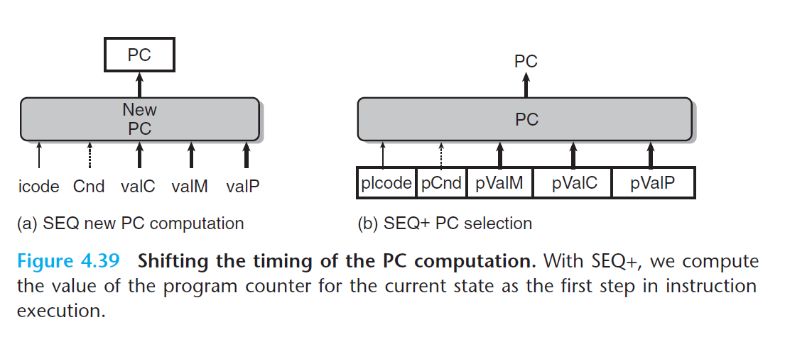
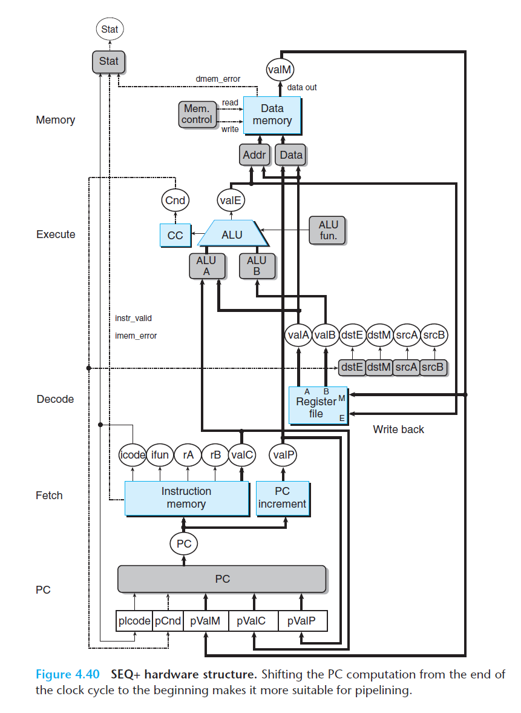

# Ch4 Processor Architecture

## 4.5 Pipelined Y86-64 Implementations

本章主要将顺序的 SQE 处理器进行改动，使其流水线化。

**SEQ+ : 重新安排计算阶段**

将 SEQ 的 PC 更新阶段提前到时钟周期开始时执行。

SEQ+ 创建了一系列状态寄存器（plcode、pCnd 等）来保存上一时钟周期内中计算出来的控制信号，当新的时钟周期开始的时候，这些信号通过和 SEQ 相同的逻辑来计算当前指令的 PC，然后再正常进行其他阶段。

实际上，SEQ+ 没使用硬件寄存器来存放 PC 程序计数器（不同于 SEQ 、 ISA 中的 `%rip` 寄存器）。

SEQ+ 这种方法被称作电路重定时（circuit retiming），重定时改变了系统的状态表示，但不改变逻辑行为；通常使用电路重定时来平衡一个流水线系统中各个阶段的延迟。

