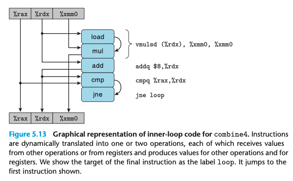
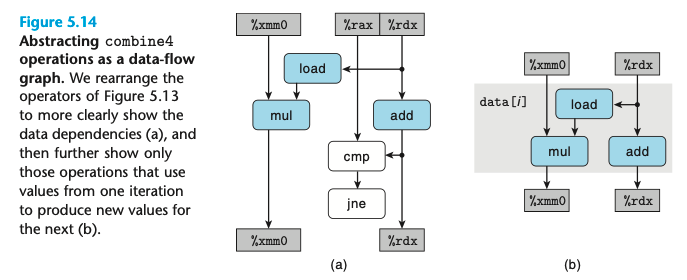

## 5.7 Understanding Modern Processors

目前为止我们所做的工作并不针对处理器，而仅仅是减少procedure的调用以及一些优化的blocker,因为他们限制了编译器的优化。

combine4的结果符合latency bound 和 throughput bound的最大值，因为受限于两个因素。

整型乘法的时延为3, 浮点加法为3，浮点乘法为5，和测试的结果相符合。

data-flow 图如上所示，对于此，我们可以把寄存器分为4类，

- read-only，rax
- write-only, no
- local, condition code reg
- loop: these are both as source values and as destinations for the loop.如rdx, xmm0

(a)中白色的部分是没有依赖的，如cmp和jne

(b)中的mul是critical path，因为浮点的乘法，比加法更费时。其他的部分实际上是可以并行的处理的，比如移动指针，从memory中读取数据。

