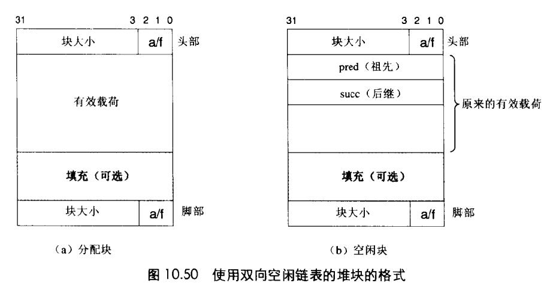
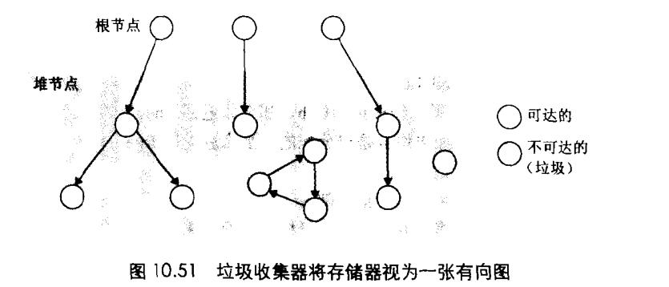

# Chapter.9 虚拟内存

---------------

## 显式空闲链表

前面我们知道了有隐式空闲链表,但是隐式空闲链表每次查找适配都需要遍历整个空闲链表,所以`如果链块逐渐变多的时候,线性的查找复杂度显然不合适`  



显式空闲链表如上图所示,即会在空闲块上构建一个双向链表的指针,故`首次适配方法`的分配时间从`块总数`,降低到了`空闲块数量`的时间复杂度.  

一般而言,显式空闲链表的缺点如下:  
- 需要指针
- 头部和脚部的内存占用
- 空闲块必须足够大
- 增大了内部碎片的程度

> 还有一种方法是`分离链表`

## 垃圾回收

比如如下代码:  

```cpp
void garbage(){
    int *p =(int*)Malloc(15123);
    return; //并没有释放p
}
```

如果调用了上述函数,因为程序不需要P,但是在堆上为p申请了内存,**导致它会在程序的整个生命周期内都保持为已分配状态**

垃圾收集器(GC)是一种动态存储分配器,它自动释放程序`不再需要`的`已分配块`。  

在一个支持GC的系统中,`应用显示分配堆块,但是从不显示的释放它们`,取而代之的是垃圾收集器`自动的识别垃圾块,自动调用free`

垃圾收集器将存储器视为一张`有向可达图`  
图中节点被分为一组`根节点`和一组`堆节点`,每个`堆节点对应一个已分配块`,



虽然看不出哪些是根,但是可以看一下大体结构

当存在一条从根触发并到p的有向路径时,我们就说一个节点`p`是可达的.

垃圾回收器会定期释放不可达节点

像Java,C#这些语言会对如何创建和使用指针有严格的控制,这些控制导致基本上可以搜集所有的垃圾.

而C、C++这样的语言,不可能维护一个精确地可达图(不自己去实现的话),这样的收集器也称为`保守的垃圾回收器`  
即`每个可达块都被正确的标记`,`但是每个不可达块可能被错误的标记`

### Mark&Sweep垃圾收集器


--------------


> Latex转Svg

https://www.latexlive.com/