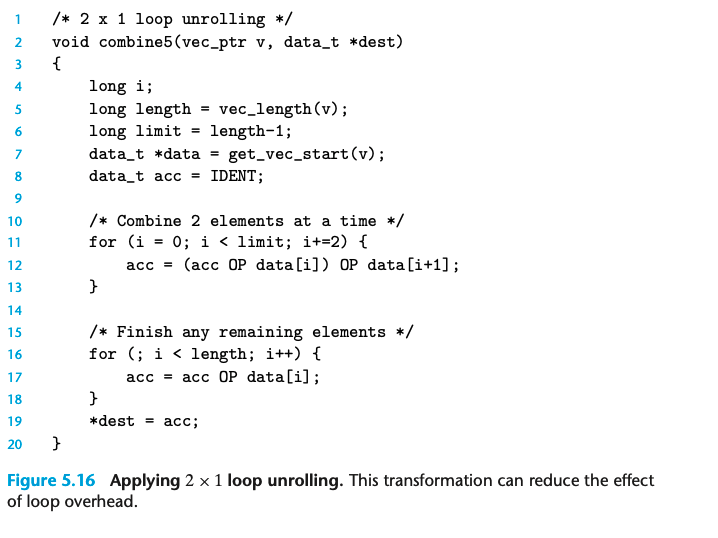

## 5.8 Loop Unrolling

loop unrolling 是一种通过在每个循环中增加处理的数据从而减少迭代的次数。

这是一个简单的`2 x 1 loop unrolling`:

这里我们看到 line 12 中，每次处理了两个数据

但是实际上这种方式在这个例子中并没有增加运行速度。

我们来看看汇编代码：

loop unrolling 带来了两次的vmulsd操作，critical path中仍然有n次的mul操作。

尽管每次我们处理了两个数据，但是相应的我们需要两次对应operation。
