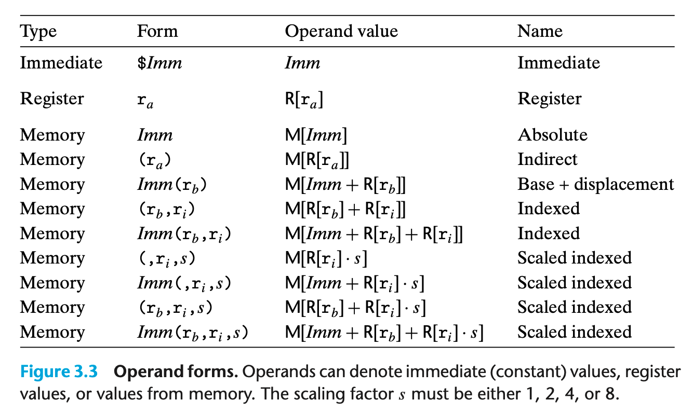

## 3.4.1 Operand Specifiers

result can be stored in either registers or memory

* immediate -> constant values eg. $0x1F
* register -> contents of a register
* memory reference -> access memory location according to a computed address

 数组表示方式： $Imm\left( r_{b}, r{i}, s\right)$ ，$Imm$ 为立即数偏移，$r_b$ 为基址寄存器，$r_i$ 为变址寄存器，$s$ 为扩大因子。
