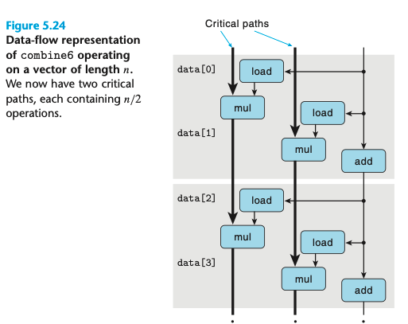

## 5.9 Enhancing Parallelism

### 5.9.1 Multiple Accumulators

对于a0*an-1 可以把他分解成a0*...*an/2 an/2*...*an;

相比于上个例子，我们管他叫做`2 x 2 loop unrolling`

核心的部分如下：

```
for (i = 0; i < limit; i += 2) {
    acc0 = acc0 OP data[i];
    acc1 = acc1 OP data[i + 1];
}
```

从结果上显示，所有运算基本上都快了2倍，他的data-flow 大概如下所示：



对于浮点运算而言，编译器可能会比较小心地做这种优化，因为他并不具有associative的特性。


