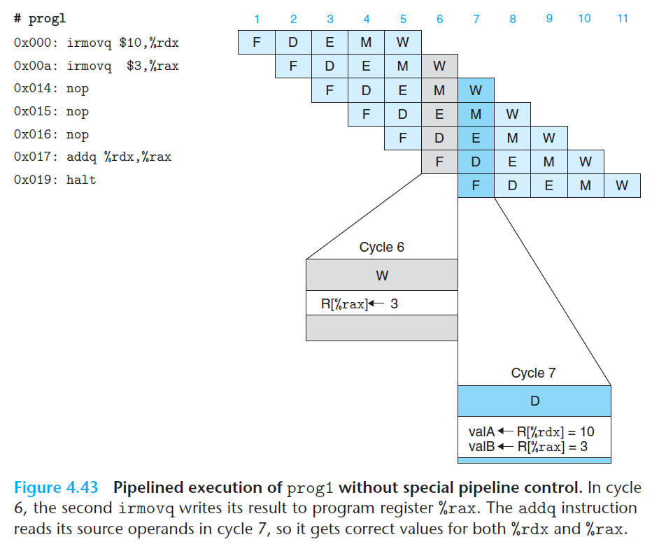
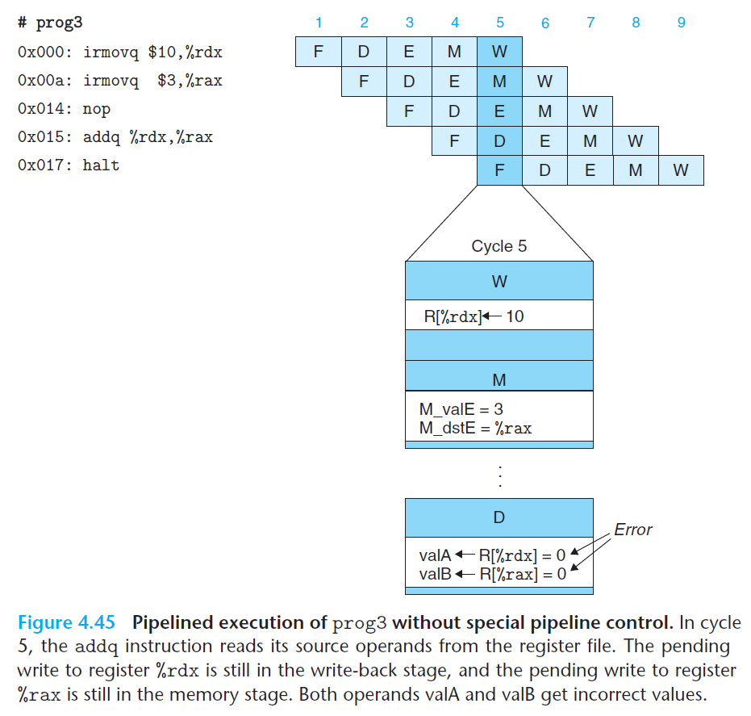

# Ch4 Processor Architecture

## 4.5 Pipelined Y86-64 Implementations

**Pipeline Hazards**

指令上下文之间存在的数据相关和控制相关可能会导致流水线计算错误，这种错误成为流水线冒险，分为数据冒险和控制冒险。

当一条指令更新后面指令相关的程序状态（包括程序寄存器、程序计数器、内存、条件码寄存器、状态码寄存器等）时，就有可能出现数据冒险。分析：

* 程序寄存器，不同指令间对寄存器文件的读写在不同阶段，可能导致冒险；
* 程序计数器，更新和读取 PC 寄存器之间可能导致控制冒险，例如，错误的分支预测、`ret `指令的处理；
* 内存，对数据内存的读写都发生在访存阶段，在一条读内存的指令到达之前，前面的写内存指令都已经完成了。存在的一个问题是访存阶段的写数据指令和取指阶段的读指令可能存在冲突，因为指令和数据内存访问是同一个地址空间，这种情况只有**在自我修改代码的程序（self-modifying code）中才会出现**，因此，有系统有机制来检查这种冒险，也有系统禁止程序自我修改代码；
* 条件码寄存器，执行阶段中，整数操作会写条件码寄存器，条件传送和条件转移指令会在访存阶段读该寄存器，这是时序性的，因此不会发生冒险；
* 状态寄存器，采用了流水线中的每个指令都和状态码相关联的机制，当指令产生异常时，处理器能够处理。

在流水线中，需要处理寄存器数据冒险、控制冒险、以及异常。

例子如下：

	

