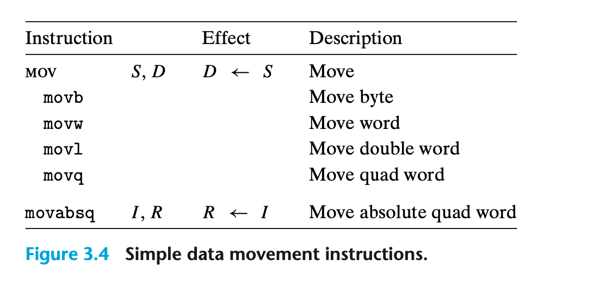

### 3.4.2 Data Movement Instructions

拷贝数据的指令是最常用的；operand notation 用来帮助我们简单的表示移动数据的指令，可能实际在许多机器上都需要多个不同的指令才能完成。

1 movl $0x4050,%eax 立即数 -> 寄存器
2 movw %bp,%sp 寄存器 -> 寄存器
3 movb (%rdi,%rcx),%al 内存 -> 寄存器
4 movb $-17,(%esp) 立即数 -> 内存
5 movq %rax,-12(%rbp) 寄存器 -> 内存

移动指令 source -> destination
memory -> memory 需要两个指令 先从memory移动到寄存器，再从寄存器移动到另一块memory