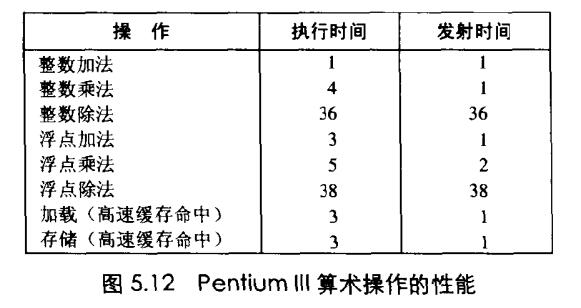

# Chapter.5 优化程序性能

--------------
## 理解现代处理器

流水线中的两个模块：指令控制单元ICU(Instruction Control Unit)、执行单元EU(Execution Unit)

### 功能单元的性能

> 功能单元是每个运算单元  刻画其性能主要包括以下三点

- 1. `延迟`: 表示完成运算所需要的总时间
- 2. `发射时间`: 两个连续的同类型运算之间需要的最小时钟周期数
- 3. `容量`: 表示能够执行该运算的功能单元的数量



上图所示的是加法乘法和除法在整数和浮点数时的性能刻画

> 除法的延迟和发射时间依赖于他的前一些指令,即不是完全流水线化的.  
> 加法是完全流水线化的

#### 关键路径
 
执行一组指令（一次循环），所需要时钟周期的下界。   
优化的思想，即是最大化减少关键路径所需时间周期。  
通过分析循环内c代码及汇编代码，优化代码使关键路径时间最短。  
然后可以利用循环展开、多个积累变量、重新结合变换进行下一步优化。  

> 循环展开  

即减少循环次数,增加每次循环的操作量  
可以减少的: `索引计算、条件判断、循环跳转等`

```cpp
//简单循环
for( int i=0 ; i<n ; i++ ) { ... }
// 变为:
for( int i=0 ; i<n-k ; i += k ) 
{ .../*内部每次处理k个元素*/... } 
for( ; i<n ; i++) 
{ .../*继续处理后续的n-k~n位*/... }
```

#### 多个累计变量

比如从1乘到10,  


```cpp
for(int i=0;i<limit;i+=2){
    acc0 = acc0 OP data[i];
    acc1 = acc1 OP data[i+1];
}

//处理剩下的元素
for(;i<length;++i){
    acc0=acc0 OP data[i];
}

*dest = acc0 OP acc1;

```

就是拆分


--------------


> Latex转Svg

https://www.latexlive.com/