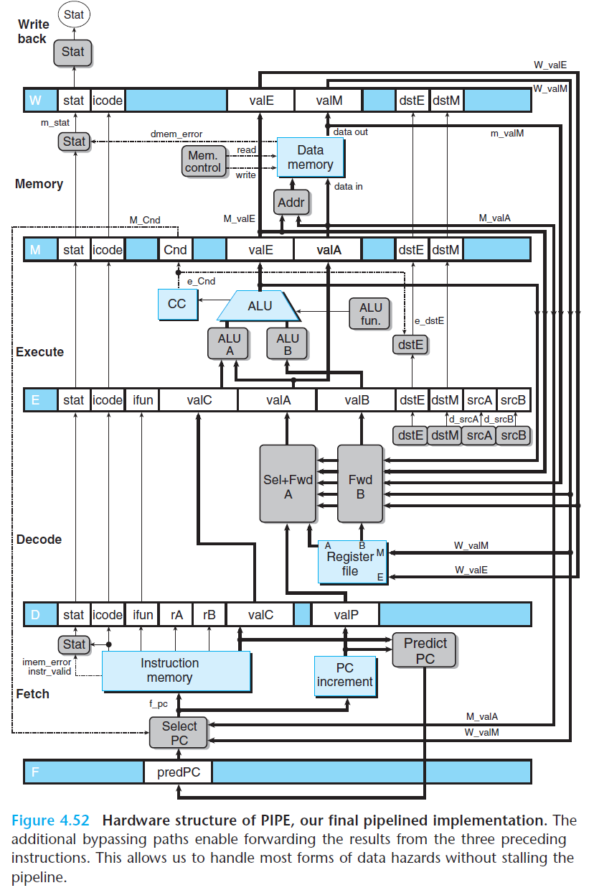

# Ch4 Processor Architecture

## 4.5 Pipelined Y86-64 Implementations

**Pipeline Hazards**

1. Stalling

    流水线阻塞：处理器停止流水线中的后续指令，直到冒险条件不再满足。该方法通过硬件实现，控制较为复杂，需要改变数据通路。此外，还可以通过编译器插入 `NOP` 指令来实现。

    流水线阻塞会导致流水线暂停数个周期，降低整体的吞吐量。

    

2. Data Forwarding / bypassing

    在硬件结构中增加额外的数据连接和控制逻辑，转发已经更新的数据给发生数据冲突的指令，避免从寄存器中读出错误的值。这种做法可以转发在执行 / 访存/ 写回周期的数据。

    为什么能转发执行阶段，涉及 ALU 的数据？

    * 这种做法直接从 ALU 输入端直接取数据到流水线寄存器，而寄存器的写/读发生在时钟的前/后半周期，这样写入能在时钟上升沿时被直接读出，不发生冲突。

    转发的流水线  PIPE 结构，加入了 `Sel + Fwd A` 和 `Fwd B` 的块。

    

3. Load / Use Data Hazards

    有一类**写后读**的数据冒险不能单纯用转发来解决，因为内存读在流水线发生的相对较晚。可以使用暂停和转发结合起来的手段（互锁加载，load interlock），来避免 Load / Use Data Hazards 这种冒险。

    此外，编译器优化，调整指令的执行顺序也可以解决该问题。

    

4. Avoiding Control Hazards

    控制冒险发生这在 `ret`等指令 和 跳转指令中，在条件跳转指令中，预测错误会造成很大的开销。

    如果是 `call ` 这样的指令，可以通过流水线阻塞几个周期来实现正确跳转；

    如果是 `jne` 这样的指令，如果发生分支判断错误，可以通过 Cancel / instruction squashing 的方式解决，在新的指令执行阶段之前（即 ALU 不改变状态码之前）来进行流水线阻塞；这种方式需要阻塞分支预测失误指令的那几个时钟周期，这样预测失误的指令直接就在流水线中消失同时不改变流水线的状态，唯一的代价就是浪费数个时钟周期。

    

    此外，异常和中断是特殊的控制冒险，因为其会改变程序的执行流程，其处理的思路如下：

    * 清楚流水线中的指令
    * 关中断，保存 PC寄存器；
    * 从中断向量表上取指令，送入 PC。

    

