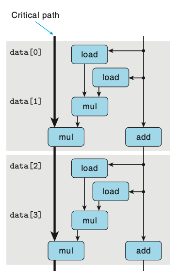

### 5.9.2 Reassociation Transformation

在计算acc时我们原先的方法是:

`acc = (acc OP data[i]) OP data[i + 1]`

更改顺序后变为:

`acc = acc OP (data[i] OP data[i + 1])`

令人惊奇的是，这种做法理论上应该不会带来性能提高，但是除了整数的加法以外，其他所有的方法都如同parallel的那个版本一样快。

需要注意的是，尽管有两次mul操作，但是两个load data的mul操作是不依赖于上一个mul的，所以critical path中只有n/2次的mul操作。

### practice 5.8

A1: 15
A2: 10
A3: 5
A4: 5
A5: 10

答案：需要把这些数都除以5，因为是perelement每次循环体都有3个element

