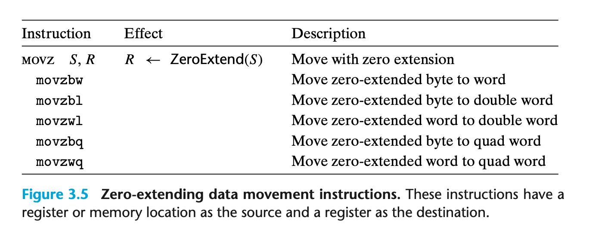
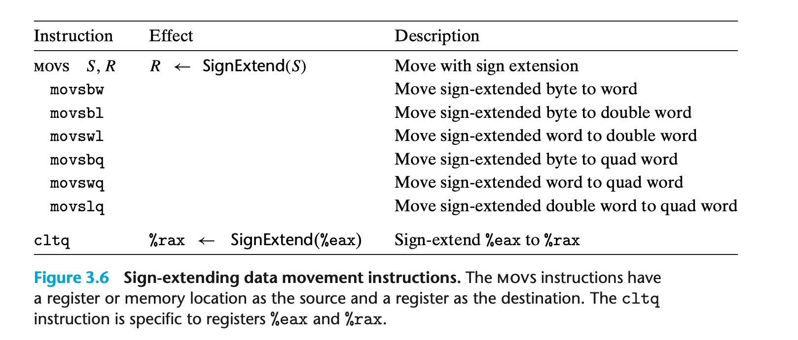

### 3.4.2 Data Movement Instructions
smaller source -> larger destination

1 movabsq $0x0011223344556677, %rax 
2 movb $-1, %al
3 movw $-1, %ax
4 movl $-1, %eax
5 movq $-1, %rax

1 %rax = 0011223344556677
2 %rax = 00112233445566FF
3 %rax = 001122334455FFFF
4 %rax = 00000000FFFFFFFF
5 %rax = FFFFFFFFFFFFFFFF

零扩展 ｜ 符号位扩展



### 3.4.3 Data Movement Example
```c
long exchange(long *xp, long y)
{
    long x = *xp;
    *xp = y;
    return x;
}
```

->
```assembly
1 exchange: 
2 movq (%rdi), %rax
3 movq %rsi, (%rdi)
4 ret
```
%rax 用于返回返回值

1. pointers are simply address 取值的时候先将pointer放入寄存器；用 memory reference 的方式使用寄存器
2. 本地变量也常用寄存器直接存储；而不是放在内存中；这是为了更高的效率