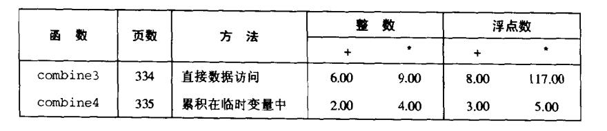

# Chapter.5 优化程序性能

--------------
## 更近距离观察处理器操作

先看这个代码.实现的功能是把数组中的数全部按照OPEN计算到dest中

```cpp
void combine4(vec_ptr v,data_t *dest){
    int i;
    int length = vec_length(v);
    data_t *data = get_vec_start(v);
    data_t x = IDENT;

    *dest = IDENT;
    for(i=0;i<length;++i){
        x = x OPEN data[i];
    }
    *dest = x;
}
```

### 将指令翻译成操作

上述代码如果`把结果都计算到dest中`,汇编代码如下

```
.L18:
    movl (%edi),%edx    Read *dest
    imull (%ecx,%edx,4),%eax    Multiply by data[i]
    movl %eax,(%edi)    Write *dest
    incl %edx           i++
    cmpl %esi,%edx      Compare i:length
    jl .L18             if<goto loop
```

上述代码中,指令2从dest中读取数据,然后在指令4再写回这个位置,这是一种浪费,`因为正常情况下,下一次迭代时指令2读取的值会是刚刚写会的值`

combine4函数,对上述代码的优化是:  
- 1. 引入一个临时变量x,它在循环中存放计算出来的值
- 2. 循环结束后,才会把值写回dest

这样就可以把每次迭代的两次读和一次写减少到只需要一次读。  

编译器会把临时值存放在寄存器`eax`中

```
.L24:
    imull (%eax,%edx,4),%ecx    Multiply x by data[i]
    incl  %edx                  i++
    cmpl  %esi,%edx             Compare i:length
    jl    .L24                  if<goto loop
```

上述代码的优化对于浮点数而言,优化最大




## 一些限制因素

### 寄存器溢出

指令是可以并行的,比如在一个循环中计算两个加法,然后在最后将这两个值再加起来  
那么循环中的这两个加法是可以并行的  但是

如果寄存器只有16个,而循环中的加法分解`超过了16`,可能导致编译器需要在栈上分配额外的空间去存储中间值  
**反而会拖慢节奏**


### 分支预测和预测错处罚

当指令遇到条件语句时`必须猜测往哪里走`  
如果猜测对了,`流水化的指令`可以发挥最大效能  
但如果猜测错了,就需要回到执行前的指令,然后重新执行一遍(预测错误的触发是19个时钟周期)

解决方法可以使用`数据传送`

(但其实没有太大必要去在乎分支预测)


## 确认和消除性能瓶颈

### 程序剖析

> 就是类似于Unity的Profile

将耗时输出,一步一步的找到最耗时的部分,然后开始优化


--------------


> Latex转Svg

https://www.latexlive.com/