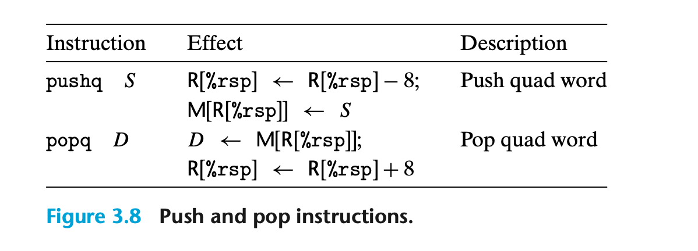

### 3.4.4 Pushing and Popping Stack Data
Stack 是 函数调用的关键所在。
LIFO

栈顶是进行插入、删除操作的一侧。  %rsp 始终表示栈顶的地址。
所以push的操作就是先对 %rsp 进行 -8 的操作，移动栈顶指针，再修改栈顶元素的位置。
程序可以按照常规方式对栈中元素进行访问。比如栈顶是一个quad word。
 movq 8(%rsp),%rdx 会把第二个quad word放入寄存器中。