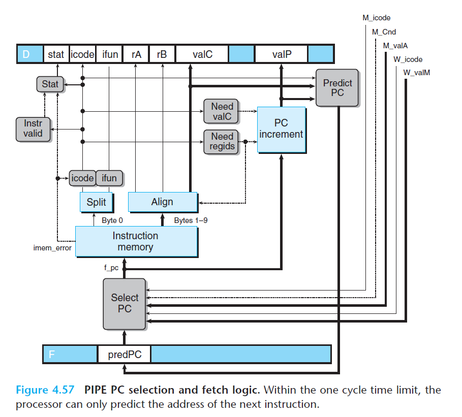
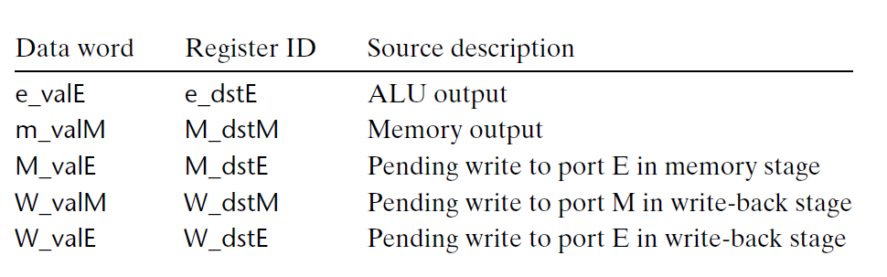
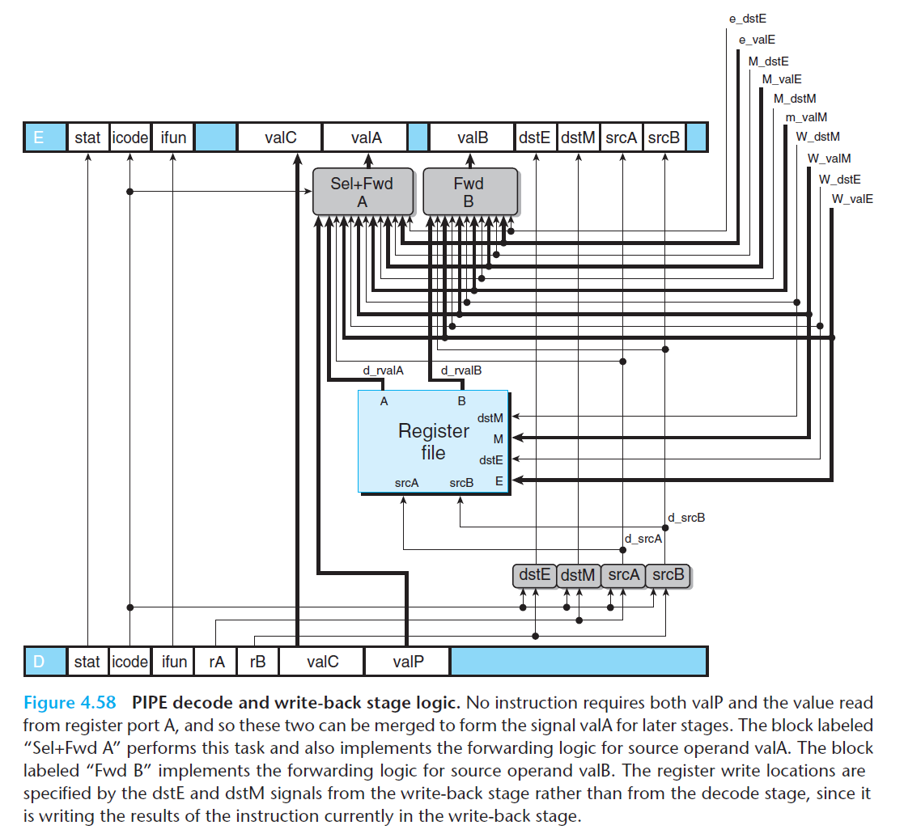
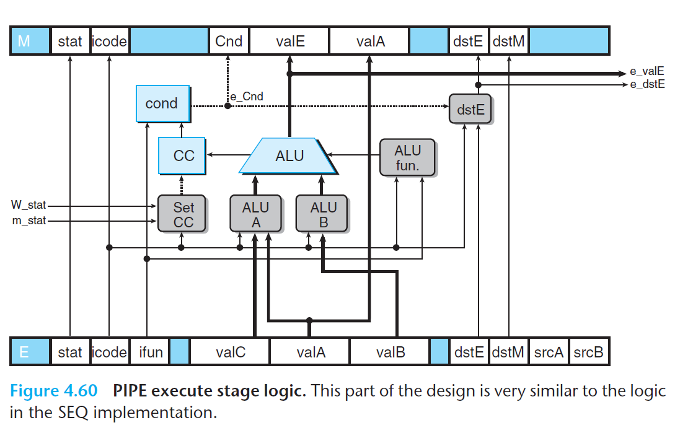

# Ch4 Processor Architecture

## 4.5 Pipelined Y86-64 Implementations

**PIPE Stage Implementations**

PIPE 和 SEQ 的逻辑块基本相同，新增了流水线寄存器，具体实现有以下不同：

* PC Selection and Fetch Stage

    PC 值的来源，具体看图中的 `Select PC` 块的逻辑：

    1. 预测错误的分支进入访存阶段时，从流水线寄存器 M （信号 `M_valA`）中读出 `valP` 作为下一条指令的地址；
    2. `ret` 指令进入写回阶段是，会从信号`W_valM` 中读取返回地址；
    3. 使用 `Pred PC` 中的 PC 预测值。

    

* Decode and Write-Back Stage

    `Sel + Fwd` 块扮演两个角色：

    1. 为后面阶段将 `valP` 信号合并到 `valA` 信号，可以减少流水线寄存器中状态的数量；

        合并信号的原因是，只有 `call`  和 `jump` 指令需要 `valP` 的值，可以由 `icode` 控制。

    2. 实现了源操作数 `valA` 的转发。

    

    

    

    

* Execute Stage

    `Set CC ` 块的改变。

    

    

* Memory Stage

    

    

