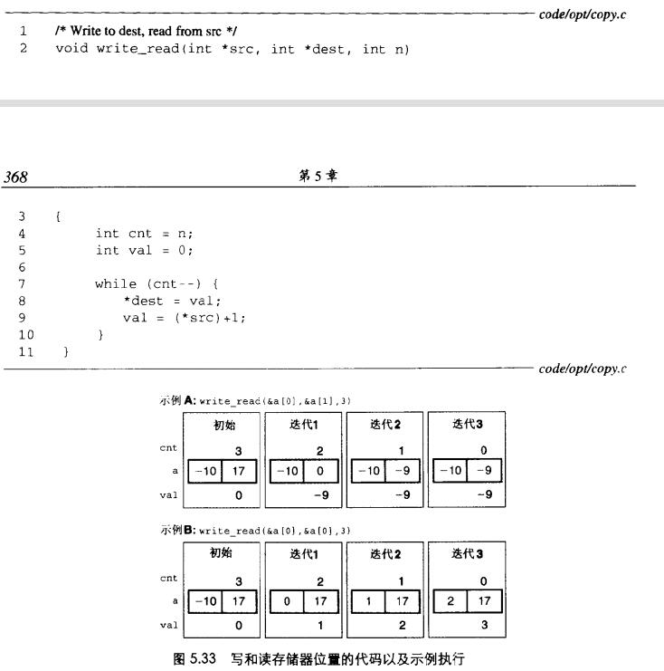

# Chapter.5 优化程序性能

--------------
## 书写适合用于条件传送实现的代码

分支预测只对有规律的模式可行。但有些时候,程序中的许多测试是不可预测的.

例如判断一个书是正数还是负数,对于这些测试,分支预测逻辑会处理的很糟糕  

`命令式`与`功能式`的风格  

- 命令式(条件跳转)  

```cpp
void minmax1(long a[],long b[],long n){
    long i;
    for(i = 0;i<n;++i){
        if(a[i]>b[i]){
            long t = a[i];
            a[i]=b[i];
            b[i] = t;
        }
    }
}
```

对于上面这段代码,每次都要猜测a[i]是否大于b[i],一旦猜错,得到的CPE大约为13.5


- 功能性(数据传送)

```cpp
void minmax1(long a[],long b[],long n){
    long i;
    for(i = 0;i<n;++i){
        long min = a[i] < b[i] ? a[i] : b[i];
        long max = a[i] < b[i] ? b[i] : a[i];
        a[i] = min;
        b[i] = max;
    }
}
```

功能性与命令式的方式不同,功能性是不需要进行分支预测,而是类似于直接进行赋值.  
但是可读性会差很多

## 理解内存性能

如果我们都只需要访问少量的内存,而现在所有的现代处理器都包含一个或多个`高速缓存`存储器,以应对`少量的存储器提供快速的访问`

本节只考虑数据存放在高速缓存中的情况

### 加载的性能

影响加载性能的主要指令  

如下所示代码: 

```csharp
typedef struct ELE{
    struct ELE *next;
    long data;
} list_ele,*list_ptr;

long list_len(list_ptr ls){
    long len = 0;
    while(ls){
        len++;
        ls = ls->next;
    }
    return len;
}
```

其中循环部分的汇编代码如下:  

```
.L3:
    addq $1,%rax
    movq (%rdi),%rdi
    testq %rdi,%rdi
    jne .L3
```

其中影响循环性能最关键的瓶颈是 `movq`指令

### 存储的性能



如上图所示,在同一段代码中,调用了两个指针计算结果  

- 1. 两个指针分别指向 a[0] 和 a[1]
- 2. 两个指针都指向 a[0]

但是最终测试结果显示`示例B比示例A的运行速度要慢`

产生这个差异就要从`存储缓冲区`来观察了


--------------


> Latex转Svg

https://www.latexlive.com/